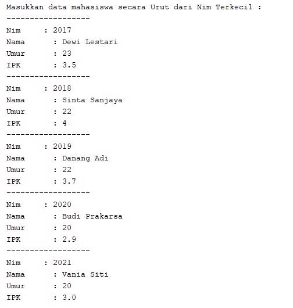
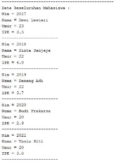
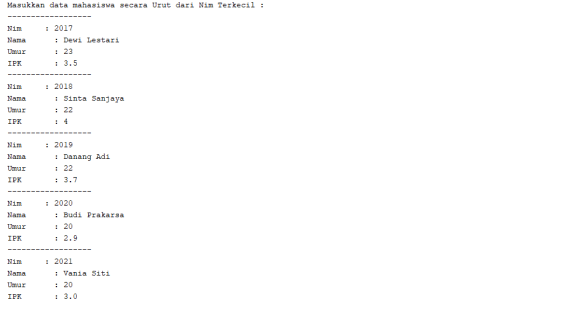
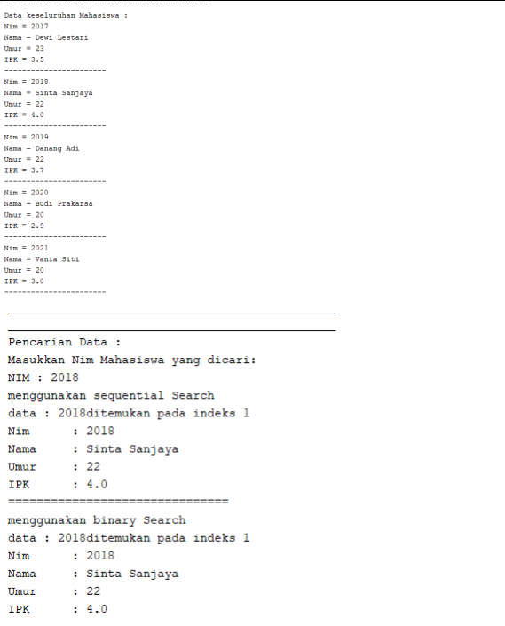
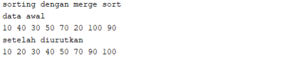
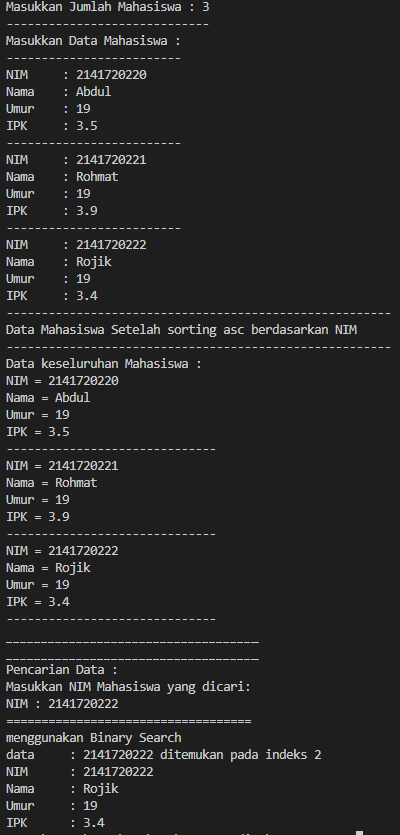
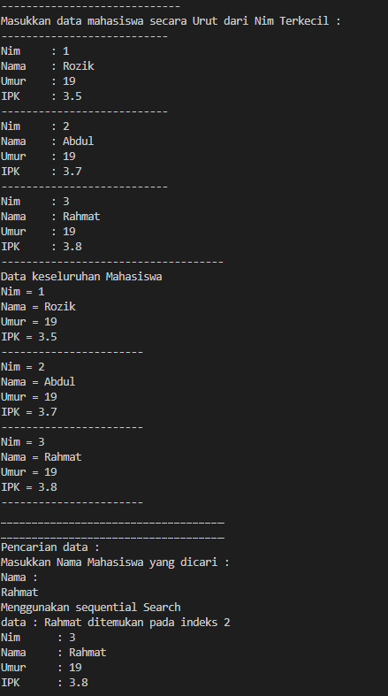
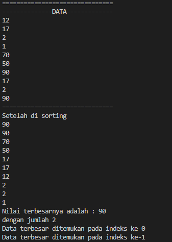

# JOBSHEET VI

# SEARCHING

## 6.1. Tujuan Praktikum


Setelah melakukan materi praktikum ini, mahasiswa mampu:

1. Menjelaskan mengenai algoritma Searching.
2. Membuat dan mendeklarasikan struktur algoritma Searching.
3. Menerapkan dan mengimplementasikan algoritma Searching.


## 6.2.1. Langkah-langkah Percobaan Sequential Search

MahasiswaMain
```java
package Jobsheet7.Praktikum;

import java.util.Scanner;

public class MahasiswaMain {
    public static void main(String[] args) {

        Scanner s = new Scanner(System.in);
        Scanner sl = new Scanner(System.in);

        PencarianMhs data = new PencarianMhs();
        int jumMhs = 5;

        System.out.println("-------------------------------------------------------");
        System.out.println("Masukkan data Mahasiswa secara urut dari Nim terkecil : ");
        for (int i = 0; i < jumMhs; i++) {
            System.out.println("---------------------------");
            System.out.print("NIM  : ");
            int nim = s.nextInt();
            System.out.print("Nama : ");
            String nama = sl.nextLine();
            System.out.print("Umur : ");
            int umur = s.nextInt();
            System.out.print("IPK  : ");
            double ipk = s.nextDouble();

            Mahasiswa m = new Mahasiswa(nim, nama, umur, ipk);
            data.tambah(m);
        }

        System.out.println("---------------------------------------------------------");
        System.out.println("Data Keseluruhan Mahasiswa");
        data.tampil();

        System.out.println("_________________________________________________________");
        System.out.println("_________________________________________________________");
        System.out.println("Pencarian Data");
        System.out.println("Masukkan NIM Mahasiswa yang di cari : ");
        System.out.println("NIM   : ");
        int cari = s.nextInt();
        System.out.println("Menggunakan Sequential Search");
        int posisi = data.FindSeqSearch(cari);
        data.TampilPosisi(cari, posisi);
        data.TampilData(cari, posisi);

        System.out.println("=======================================================");
        System.out.println("Menggunakan Binary Search");
        posisi = data.FindBinarySearch(cari, 0, jumMhs - 1);
        data.TampilPosisi(cari, posisi);
        data.TampilData(cari, posisi);

        s.close();
        sl.close();

    }
}
```
Mahasiswa
```java
package Jobsheet7.Praktikum;

public class Mahasiswa {
    int nim;
    String nama;
    int umur;
    double ipk;

    Mahasiswa(int ni, String n, int u, double i) {
        nim = ni;
        nama = n;
        umur = u;
        ipk = i;
    }

    void tampil() {
        System.out.println("NIM   = " + nim);
        System.out.println("Nama  = " + nama);
        System.out.println("Umur  = " + umur);
        System.out.println("IPK   = " + ipk);
    }
}
```
PencarianMhs
```java
package Jobsheet7.Praktikum;

public class PencarianMhs {
    Mahasiswa listMhs[] = new Mahasiswa[5];
    int idx;

    void tambah(Mahasiswa m) {
        if (idx < listMhs.length) {
            listMhs[idx] = m;
            idx++;
        } else {
            System.out.println("Data Sudah Penuh !!");
        }

    }

    void tampil() {
        for (Mahasiswa m : listMhs) {
            m.tampil();
            System.out.println("--------------------");
        }
    }

   
    public int FindSeqSearch(int cari) {
        int posisi = -1;
        for (int i = 0; i < listMhs.length; i++) {
            if (listMhs[i].nim == cari) {
                posisi = i;
                break;
            }
        }
        return posisi;
    }

    public int FindBinarySearch(int cari, int left, int right) {
        int mid;
        if (right >= left) {
            mid = (left + right) / 2;
            if (cari == listMhs[mid].nim) {
                return (mid);
            } else if (listMhs[mid].nim > cari) {
                return FindBinarySearch(cari, left, mid - 1);
            } else {
                return FindBinarySearch(cari, right, mid + 1);
            }
        }
        return -1;
    }

    public void TampilPosisi(int x, int pos) {
        if (pos != -1) {
            System.out.println("Data : " + x + " Ditemukan pada indeks " + pos);
        } else {
            System.out.println("Data : " + x + " Tidak Ditemukan");
        }
    }


    public void TampilData(int x, int pos) {
        if (pos != -1) {
            System.out.println("Nim  : " + x);
            System.out.println("Nama : " + listMhs[pos].nama);
            System.out.println("Umur : " + listMhs[pos].umur);
            System.out.println("IPK  : " + listMhs[pos].ipk);
        } else {
            System.out.println("Data " + x + " Tidak Ditemukan");
        }

    }
}
```

## 6.2.2. Verifikasi Hasil Percobaan





## 6.2.3. Pertanyaan

1. Jelaskan perbedaan metod **TampilData** dan **Tampilposisi** pada class PencarianMhs

    tampil posisi memberi tahu apakah data tersebut ada di index berapa

    tampil data memberi nilai yang ada di dalam index yang ada di tampilposisi

2. Jelaskan fungsi **break** pada kode program dibawah ini!

    untuk menghentikan perulangan
3. Jika Data Nim yang dimasukkan tidak terurut dari kecil ke besar. Apakah program masih dapat berjalan? Apakah hasil yang dikeluarkan benar? Mengapa demikian!

    bisa, di karenakan Proses pencarian dilakukan dengan membandingkan elemen array satu per satu secara beruntun mulai dari elemen pertama sampai elemen yang dicari sudah ditemukan atau sampai semua elemen sudah diperiksa

## 6.3. Searching / Pencarian Menggunakan Binary Search

## 6.3.1. Langkah-langkah Percobaan Binary Search

BinarySearch
```java
public int FindBinarySearch(int cari, int left, int right) {
        int mid;
        if (right >= left) {
            mid = (left + right) / 2;
            if (cari == listMhs[mid].nim) {
                return (mid);
            } else if (listMhs[mid].nim > cari) {
                return FindBinarySearch(cari, left, mid - 1);
            } else {
                return FindBinarySearch(cari, right, mid + 1);
            }
        }
        return -1;
    }
```
TampilBinary
```java
System.out.println("=======================================================");
        System.out.println("Menggunakan Binary Search");
        posisi = data.FindBinarySearch(cari, 0, jumMhs - 1);
        data.TampilPosisi(cari, posisi);
        data.TampilData(cari, posisi);
```

## 6.3.2. Verifikasi Hasil Percobaan





## 6.3.3. Pertanyaan

1. Tunjukkan pada kode program yang mana proses divide dijalankan!

```java
    public int FindBinarySearch(int cari, int left, int right) {
        int mid;
        if (right >= left) {
            mid = (left + right) / 2;
            
```

2. Tunjukkan pada kode program yang mana proses conquer dijalankan!

```java
            if (cari == listMhs[mid].nim) {
                return (mid);
            } else if (listMhs[mid].nim > cari) {
                return FindBinarySearch(cari, left, mid - 1);
            } else {
                return FindBinarySearch(cari, right, mid + 1);
            }
        }
        return -1;
```

3. Jika data Nim yang dimasukkan tidak urut. Apakah program masih dapat berjalan? Mengapa demikian!

    Program berjalan, namun hasil dari binary searchnya tidak karena konsep binary memerlukan pengurutan data pada algoritmanya, jadi yang tampil hasilnya hanya sequential dan binarynya mengoutputkan "data tidak ditemukan"

4. Jika Nim yang dimasukkan dari NIM terbesar ke terkecil (missal : 20215, 20214, 20212, 20211,
    20210) dan elemen yang dicari adalah 20210. Bagaimana hasil dari binary search? Apakah
    sesuai? Jika tidak sesuai maka ubahlah kode program binary seach agar hasilnya sesuai

tidak di temukan, jadi code yang di ubah
```java
public int FindBinarySearch(int cari, int left, int right) {
        int mid;
        if (right >= left) {
            mid = (left + right) / 2;
            if (cari == listMhs[mid].nim) {
                return (mid);
            } else if (listMhs[mid].nim < cari) {
                return FindBinarySearch(cari, left, mid - 1);
            } else {
                return FindBinarySearch(cari, right, mid + 1);
            }
        }
        return -1;
    }
```

5. Modifikasilah program diatas yang mana jumlah mahasiswa yang di inputkan sesuai dengan masukan dari keyboard.
```java
System.out.print("Masukkan jumlah data Mahasiswa : ");
        int jumMhs = s.nextInt();
        Mahasiswa[] a = new Mahasiswa[jumMhs];
        data.listMhs = a;
```

## 6.4. Percobaan Pengayaan Divide and Conquer

## 6.4.1. Langkah-langkah Percobaan Merge Sort
SortMain
```java
package Jobsheet7.Praktikum;

public class SortMain {
    public static void main(String[] args) {
        int[] data = {10, 40, 30, 50, 70, 20, 100, 90};
        MergeSorting mSort = new MergeSorting();
        System.out.println("Data awal");
        mSort.printArray(data);
        mSort.mergeSort(data);
        System.out.println("Setelah diurutkan");
        mSort.printArray(data);
    }
}
```

MergeSorting
```java
package Jobsheet7.Praktikum;

public class MergeSorting {
     void mergeSort(int[] data){
        this.sort(data, 0, data.length - 1);
     }

     public void merge(int data[], int left, int middle, int right) {
        int[] temp = new int[data.length];
        for (int i = left; i <= right; i++) {
            temp[i] = data[i];
        }
        int a = left;
        int b = middle + 1;
        int c = left;

        while (a <= middle && b <= right) {
            if (temp[a] <= temp[b]) {
                data[c] = temp[a];
                a++;
            } else {
                data[c] = temp[b];
                b++;
            }
            c++;
        }
        int s = middle - a;
        for (int i = 0; i <= s; i++) {
            data[c + i] = temp[a + i];
        }
    }

    private void sort(int data[], int left, int right) {
        if (left < right) {
            int midle = (left + right) / 2;
            sort(data, left, midle);
            sort(data, midle + 1, right);
            merge(data, left, midle, right);
        }

    }
    public void printArray(int arr[]) {
        int n = arr.length;
        for (int i = 0; i < n; i++) {
            System.out.print(arr[i] + " ");
        }
        System.out.println();
    }

}
```
</br>

## 6.4.2. Verifikasi Hasil Percobaan


## 6.5. Latihan Praktikum

1. Modifikasi percobaan searching diatas dengan ketentuan berikut ini
    - Sebelum dilakukan searching dengan binary search data harus dilakukan pengurutan dengan
       menggunakan algoritma sorting (pilih salah satu algoritma sorting dari pertemuan
       sebelumnya)

Mahasiswa
```java
public class tugas1 {
    int nim;
    String nama;
    int umur;
    double ipk;

    tugas1(int ni, String n, int u, double i) {
        nim = ni;
        nama = n;
        umur = u;
        ipk = i;
    }

    void tampil() {
        System.out.println("NIM = " + nim);
        System.out.println("Nama = " + nama);
        System.out.println("Umur = " + umur);
        System.out.println("IPK = " + ipk);
    }
}
```
MainMahasiswa
```java
package Jobsheet7.Praktikum;
import java.util.Scanner;
public class tugas1Main {
    
    public static void main(String[] args) {
        Scanner s = new Scanner(System.in);
        Scanner sl = new Scanner(System.in);

        tugas1Search data = new tugas1Search();
        System.out.print("Masukkan Jumlah Mahasiswa : ");
        int jumMhs = s.nextInt();
        tugas1[] x = new tugas1[jumMhs];
        data.listMhs = x;

        System.out.println("-----------------------------");
        System.out.println("Masukkan Data Mahasiswa :");
        for (int i = 0; i < jumMhs; i++) {
            System.out.println("-------------------------");
            System.out.print("NIM\t: ");
            int nim = s.nextInt();
            System.out.print("Nama\t: ");
            String nama = sl.nextLine();
            System.out.print("Umur\t: ");
            int umur = s.nextInt();
            System.out.print("IPK\t: ");
            double ipk = s.nextDouble();

            tugas1 m = new tugas1(nim, nama, umur, ipk);
            data.tambah(m);
        }

        System.out.println("-------------------------------------------------------");
        System.out.println("Data Mahasiswa Setelah sorting asc berdasarkan NIM");
        System.out.println("-------------------------------------------------------");
        System.out.println("Data keseluruhan Mahasiswa : ");
        data.tampil();
        data.selectionSort();

        System.out.println("____________________________________");
        System.out.println("____________________________________");
        System.out.println("Pencarian Data : ");
        System.out.println("Masukkan NIM Mahasiswa yang dicari: ");
        System.out.print("NIM : ");
        int cari = s.nextInt();

        System.out.println("===================================");
        System.out.println("menggunakan Binary Search");
        int posisi = data.FindBinarySearch(cari, 0, jumMhs - 1);

        data.Tampilposisi(cari, posisi);
        data.TampilData(cari, posisi);
        
        s.close();
        sl.close();
    }
}
```

PencarianMhs
```java
package Jobsheet7.Praktikum;

public class tugas1Search {
    tugas1 listMhs[];
    int idx;

    void tambah(tugas1 m) {
        if (idx < listMhs.length) {
            listMhs[idx] = m;
            idx++;
        } else {
            System.out.println("Data sudah penuh !!");
        }
    }

    void tampil() {
        for (tugas1 m : listMhs) {
            m.tampil();
            System.out.println("------------------------------");
        }
    }

    void selectionSort() {
        for (int i = 0; i < listMhs.length; i++) {
            int idxMin = 1;
            for (int j = i + 1; j < listMhs.length; j++) {
                if (listMhs[j].nim < listMhs[idxMin].nim) {
                    idxMin = j;
                }
            }
        }
    }

    public void Tampilposisi(int x, int pos) {
        if (pos != -1) {
            System.out.println("data\t : " + x + " ditemukan pada indeks " + pos);
        } else {
            System.out.println("data " + x + "tidak ditemukan");
        }
    }

    public void TampilData(int x, int pos) {
        if (pos != -1) {
            System.out.println("NIM\t : " + x);
            System.out.println("Nama\t : " + listMhs[pos].nama);
            System.out.println("Umur\t : " + listMhs[pos].umur);
            System.out.println("IPK\t : " + listMhs[pos].ipk);
        } else {
            System.out.println("data " + x + "tidak ditemukan");
        }
    }

    public int FindBinarySearch(int cari, int left, int right) {
        int mid;
        if (right >= left) {
            mid = (left + right) / 2;
            if (cari == listMhs[mid].nim) {
                return (mid);
            } else if (listMhs[mid].nim > cari) {
                return FindBinarySearch(cari, left, mid - 1);
            } else {
                return FindBinarySearch(cari, mid + 1, right);
            }
        }
        return -1;
    }
}
```


2. Modifikasi percobaan searching diatas dengan ketentuan berikut ini
    - Pencarian dilakukan berdasarkan Nama Mahasiswa (gunakan Algoritma Sequential Search)
    - Jika terdapat nama yang sama? Bagaimana keluaran dari kode program ketika pencarian
       dilakukan pada nama yang sama!

MahasiswaMain 
```java
import java.util.Scanner;

public class MahasiswaNamaMain {
    public static void main(String[] args) {
        Scanner s = new Scanner(System.in);
        Scanner s1 = new Scanner(System.in);
        
        PencarianNamaMhs data = new PencarianNamaMhs();
        
        
        System.out.print("Masukkan jumlah data mahasiswa : ");
        int jumMhs = s.nextInt();
        Mahasiswa[] e = new Mahasiswa[jumMhs];
        data.listMhs = e;
        
        System.out.println("-----------------------------");
        System.out.println("Masukkan data mahasiswa secara Urut dari Nim Terkecil : ");
        for(int i = 0; i<jumMhs; i++){
            System.out.println("---------------------------");
            System.out.print("Nim\t: ");
            int nim = s.nextInt();
            System.out.print("Nama\t: ");
            String nama = s1.nextLine();
            System.out.print("Umur\t: ");
            int umur = s.nextInt();
            System.out.print("IPK\t: ");
            double ipk = s.nextDouble();
           
            Mahasiswa m = new Mahasiswa(nim, nama, umur, ipk);
            data.tambah(m);
        }
            System.out.println("------------------------------------");
            System.out.println("Data keseluruhan Mahasiswa");
            data.tampil();
            
            System.out.println("____________________________________");
            System.out.println("____________________________________");
            System.out.println("Pencarian data : ");
            System.out.println("Masukkan Nama Mahasiswa yang dicari : ");
            System.out.println("Nama : ");
            String cari = s1.nextLine();
            System.out.println("Menggunakan sequential Search");
            int posisi = data.FindSeqSearch(cari);
            data.Tampilposisi(cari, posisi);
            data.TampilData(cari, posisi);
            System.out.println();
    }
}
```

Mahasiswa
```java
public class Mahasiswa {
        int nim;
        String nama;
        int umur;
        double ipk;
        
        Mahasiswa(int ni, String n, int u, double i){
            nim = ni;
            nama = n;
            umur = u;
            ipk = i;
        }
        void tampil(){
            System.out.println("Nim = "+ nim);
            System.out.println("Nama = "+ nama);
            System.out.println("Umur = "+ umur);
            System.out.println("IPK = "+ ipk);
        }
    }
```
PencarianMhs
```java
public class PencarianNamaMhs {
        Mahasiswa listMhs[];
        int idx;
        
        void tambah(Mahasiswa m){
            if(idx < listMhs.length){
                listMhs[idx] = m;
                idx++;
            }else{
                System.out.println("Data sudah penuh !!");
            }
        }
        void tampil(){
            for(Mahasiswa m : listMhs){
                m.tampil();
                System.out.println("-----------------------");
            }
        }
        public int FindSeqSearch(String cari){
            int posisi = - 1;
            for(int j = 0; j<listMhs.length; j++){
                if(cari.equalsIgnoreCase(listMhs[j].nama)){
                    posisi = j;
                    break;
                }
            }
            return posisi;
        }
        public void Tampilposisi(String x, int pos){
            if(pos !=  -1){
            System.out.println("data : " +x+ " ditemukan pada indeks " + pos);
            }else{           
            System.out.println("data " +x+ "tidak ditemukan");
            }
        }
        public void TampilData(String x, int pos){
            if(pos != -1){
                System.out.println("Nim\t : " + listMhs[pos].nim);
                System.out.println("Nama\t : " + x);
                System.out.println("Umur\t : " + listMhs[pos].umur);
                System.out.println("IPK\t : " + listMhs[pos].ipk);
            }else{
                System.out.println("data " +x+ "tidak ditemukan ");
            }
      }
 }
 ```
 Hasil
 

3. Terdapat sebuah data array 1 dimensi sebagai berikut

```
0 1 2 3 4 5 6 7 8 9
12 17 2 1 70 50 90 17 2 90
```
Buatlah program untuk mengurutkan array tersebut (boleh memilih metode pengurutan)
selanjutnya lakukan pencarian dan mencetak isi array yang nilainya terbesar, dan mencetak ada
berapa buah nilai terbesar tersebut serta berada dilokasi mana saja nilai terbesar tersebut!
(menggunakan binary search)

Array
 ```java
 public class tugas3Array {
     int[] data;
     int max = 0;
     int posisi;
     int jumlah = 0;

    tugas3Array(int nilai[]) {
        data = nilai;
    }

    void tampil() {
        for (int i = 0; i < data.length; i++) {
            System.out.print(data[i] + " ");
            System.out.println();
        }
    }

    void bubbleSort() {
        for (int i = 0; i < data.length - 1; i++) {
            for (int j = 1; j < data.length - i; j++) {
                if (data[j] > data[j - 1]) {
                    int tmp = data[j];
                    data[j] = data[j - 1];
                    data[j - 1] = tmp;
                }
            }
        }
    }

    public int FindBinarySearch(int cari, int kiri, int kanan) {
        int mid;
        if (kanan >= kiri) {
            mid = (kiri + kanan) / 2;
            if (cari == data[mid]) {
                return (mid);
            } else if (data[mid] > cari) {
                return FindBinarySearch(cari, mid + 1, kanan);
            } else {
                return FindBinarySearch(cari, kiri, mid - 1);
            }
        }
        return -1;
    }

    public int nilaiTerbesar() {
        for (int i = 0; i < data.length; i++) {
            if (data[i] > max) {
                max = data[i];
            }
        }
        System.out.println("Nilai terbesarnya adalah : " + max);
        return max;
    }

    public void tampilPosisi(int pos) {
        for (int i = 0; i < data.length; i++) {
            if (data[i] == max) {
                jumlah++;
            }
        }
        System.out.print("dengan jumlah " + jumlah);
        System.out.println();
        posisi = max;
        for (int i = 0; i < data.length; i++) {
            if (posisi == data[i]) {
                pos = i;
                System.out.println("Data terbesar ditemukan pada indeks ke-" + pos);
            }
        }
    }
}
```

MainArray
```java
public class tugas3ArrayMain {
    public static void main(String[] args) {
        int bil[] = {12, 17, 2, 1, 70, 50, 90, 17, 2, 90};
        
        tugas3Array arr = new tugas3Array(bil);
        
        int jum = 10;
        int max = 0;
        System.out.println("===============================");
        System.out.println("--------------DATA-------------");
        arr.tampil();
        arr.bubbleSort();
        System.out.println("===============================");
        System.out.println("Setelah di sorting");
        arr.tampil();
        arr.nilaiTerbesar();
        arr.FindBinarySearch(max, 0, jum - 1);
        arr.tampilPosisi(max);
    }
}
```
hasil

