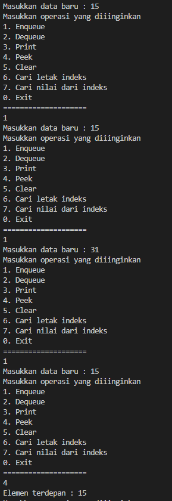
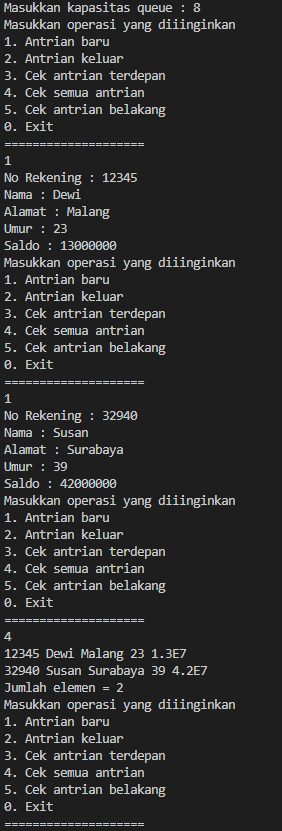
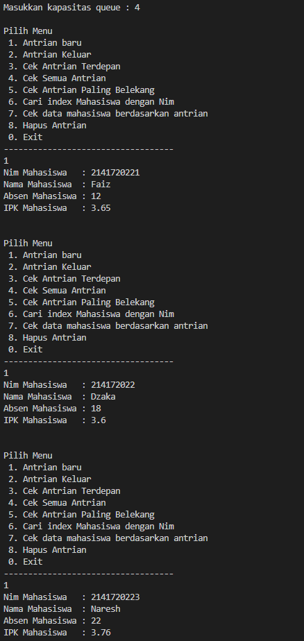
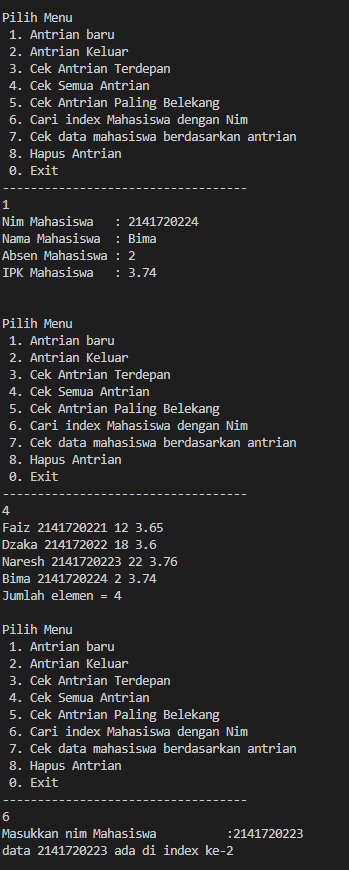
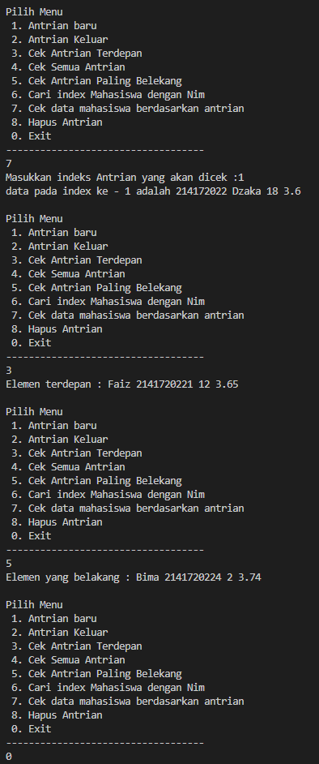

# JOBSHEET VIII

# QUEUE

## 8. 1 Tujuan Praktikum

```
Setelah melakukan materi praktikum ini, mahasiswa mampu:
```
1. Mengenal struktur data Queue
2. Membuat dan mendeklarasikan struktur data Queue
3. Menerapkan algoritma Queue dengan menggunakan array

## 8. 2 Praktikum 1

```
Waktu percobaan : 45 menit
Pada percobaan ini, kita akan mengimplementasikan penggunaan class Queue.
```
## 8. 2 .1 Langkah-langkah Percobaan
Queue
```java
package jobsheet10.Praktikum;

public class Queue {

    int data[];
    int front, rear, size, max;

    public Queue(int n) {
        max = n;
        data = new int[max];
        size = 0;
        front = rear = -1;
    }

    public boolean IsEmpty() {
        if (size == 0) {
            return true;
        } else {
            return false;
        }
    }

    public boolean IsFull() {
        if (size == max) {
            return true;
        } else {
            return false;
        }
    }

    public void peek() {
        if (!IsEmpty()) {
            System.out.println("Elemen terdepan : " + data[front]);
        } else {
            System.out.println("Queue masih kosong");
        }
    }

    public void peekPosition(int n) {
        if (!IsEmpty()) {
            for (int i = 0; i < max; i++) {
                if (data[i] == n) {
                    System.out.println("Elemen berada pada indeks ke : " + i + " yaitu data ke " + (i + 1));
                }
            }
        }
    }

    public void peekAt(int position) {
        for (int i = 0; i < max; i++) {
            if (i == position) {
                System.out.println("Nilai dari indeks tersebut adalah : " + data[position]);
            }
        }
    }

    public void print() {
        if (IsEmpty()) {
            System.out.println("Queue masih kosong");
        } else {
            int i = front;
            while (i != rear) {
                System.out.println(data[i] + " ");
                i = (i + 1) % max;
            }
            System.out.println(data[i] + " ");
            System.out.println("Jumlah elemen = " + size);
        }
    }

    public void clear() {
        if (!IsEmpty()) {
            front = rear = -1;
            size = 0;
            System.out.println("Queue berhasil dikosongkan");
        } else {
            System.out.println("Queue masih kosong");
        }
    }

    public void Enqueue(int dt) {
        if (IsFull()) {
            System.out.println("Queue sudah penuh");
        } else {
            if (IsEmpty()) {
                front = rear = 0;
            } else {
                if (rear == max - 1) {
                    rear = 0;
                } else {
                    rear++;
                }
            }
            data[rear] = dt;
            size++;
        }
    }

    public int Dequeue() {
        int dt = 0;
        if (IsEmpty()) {
            System.out.println("Queue masih kosong");
        } else {
            dt = data[front];
            size--;
            if (IsEmpty()) {
                front = rear = -1;
            } else {
                if (front == max - 1) {
                    front = 0;
                } else {
                    rear++;
                }
            }
        }
        return dt;
    }
}
```
QueueMain
```java
package jobsheet10.Praktikum;

import java.util.Scanner;

public class QueueMain {
  

    public static void menu() {
        System.out.println("Masukkan operasi yang diiinginkan");
        System.out.println("1. Enqueue");
        System.out.println("2. Dequeue");
        System.out.println("3. Print");
        System.out.println("4. Peek");
        System.out.println("5. Clear");
        System.out.println("6. Cari letak indeks");
        System.out.println("7. Cari nilai dari indeks");
        System.out.println("0. Exit");
        System.out.println("====================");
    }

    public static void main(String[] args) {

        Scanner sc = new Scanner(System.in);
        System.out.print("Masukkan kapasitas queue : ");
        int n = sc.nextInt();

        Queue Q = new Queue(n);

        int pilih;

        do {
            menu();
            pilih = sc.nextInt();
            switch (pilih) {
                case 1:
                    if (Q.IsFull()) {
                        pilih = 0;
                    } else {
                        System.out.print("Masukkan data baru : ");
                        int dataMasuk = sc.nextInt();
                        Q.Enqueue(dataMasuk);
                        break;
                    }
                case 2:
                    if (Q.IsEmpty()) {
                        pilih = 0;
                    } else {
                        int dataKeluar = Q.Dequeue();
                        if (dataKeluar != 0) {
                            System.out.println("Data yang dikeluarkan : " + dataKeluar);
                            break;
                        }
                    }
                case 3:
                    Q.print();
                    break;
                case 4:
                    Q.peek();
                    break;
                case 5:
                    Q.clear();
                    break;
                case 6:
                    System.out.print("Masukkan nilai dari indeks yang dicari : ");
                    int cari = sc.nextInt();
                    Q.peekPosition(cari);
                    break;
                case 7:
                    System.out.print("Masukkan indeks yang anda cari : ");
                    int p = sc.nextInt();
                    Q.peekAt(p);
                    break;
            }
        } while (pilih == 1 || pilih == 2 || pilih == 3 || pilih == 4 || pilih == 5 || pilih == 6 || pilih == 7);
         sc.close();
    }
}
```
## 8. 2 .2 Verifikasi Hasil Percobaan



## 8. 2 .3 Pertanyaan

1. Pada konstruktor, mengapa nilai awal atribut front dan rear bernilai -1, sementara atribut size bernilai 0?

    Artinya atribut front dan rear kosong. Jika diinisialisasi 0 maka artiya ada nilai di index 0 sedangkan -1 berarti tidak ada nilai di index manapun

2. Pada method **Enqueue** , jelaskan maksud dan kegunaan dari potongan kode berikut!

    ```java
    if(rear == max -1){
    front =0;
    }
    ```
    Artinya jika rear berada di tempat paling belakang indeks, maka jika ditambah nilai lagi rear akan berada di indeks 0

3. Pada method **Dequeue** , jelaskan maksud dan kegunaan dari potongan kode berikut!

    ```java
    if(front == max -1){
    front =0;
    }
    ```
    Artinya jika front berada di terakhir indeks dan jika dihapus nilai maka front akan berada di indeks 0 / terdepan

4. Pada method **print** , mengapa pada proses perulangan variabel i tidak dimulai dari 0 ( **int i=0** ),melainkan **int i=front**?

    Karena tidak selalu awal dari indeks yang bernilai itu bermulai dari indeks 0

5. Perhatikan kembali method **print** , jelaskan maksud dari potongan kode berikut!

    ```java
    i = (i + 1) % max
    ```
    Artinya memberitahu indeks sudah di indeks terakhir (max) sehingga jika iya akan dihentikan
6. Tunjukkan potongan kode program yang merupakan queue overflow!
    ```java
    if(isFull()){
    System.out.println("Queue sudah penuh");
    }
    ```
7. Pada saat terjadi queue overflow dan queue underflow, program tersebut tetap dapat berjalandan hanya menampilkan teks informasi. Lakukan modifikasi program sehingga pada saat terjadi queue overflow dan queue underflow, program dihentikan!
```java
do {
            menu();
            pilih = sc.nextInt();
            switch (pilih) {
                case 1:
                    if (Q.IsFull()) {
                        System.exit(0); //ubah
                    } else {
                        System.out.print("Masukkan data baru : ");
                        int dataMasuk = sc.nextInt();
                        Q.Enqueue(dataMasuk);
                        break;
                    }
                case 2:
                    if (Q.IsEmpty()) {
                        System.exit(0); //ubah
                    } else {
                        int dataKeluar = Q.Dequeue();
                        if (dataKeluar != 0) {
                            System.out.println("Data yang dikeluarkan : " + dataKeluar);
                            break;
                        }
                    }
```
## 8.3 Praktikum 2

**Waktu percobaan : 45 menit**
Pada percobaan ini, kita akan membuat program yang mengilustrasikan teller di bank dalam
melayani nasabah.

## 8.3.1 Langkah-langkah Percobaan

Queue
```java
package jobsheet10.Praktikum.Praktikum2;

public class Queue {
    Nasabah[] data;
    int front, rear, size, max;

    public Queue(int n) {
        max = n;
        data = new Nasabah[max];
        size = 0;
        front = rear = -1;
    }

    public boolean IsEmpty() {
        if (size == 0) {
            return true;
        } else {
            return false;
        }
    }

    public boolean IsFull() {
        if (size == max) {
            return true;
        } else {
            return false;
        }
    }

    public void peek() {
        if (!IsEmpty()) {
            System.out.println("Elemen terdepan : " + data[front].norek + " " + data[front].nama + " "
                    + data[front].alamat + " " + data[front].umur + " " + data[front].saldo);
        } else {
            System.out.println("Queue masih kosong");
        }
    }

    public void peekRear() {
        if (!IsEmpty()) {
            System.out.println("Elemen terdepan : " + data[rear].norek + " " + data[rear].nama + " " + data[rear].alamat
                    + " " + data[rear].umur + " " + data[rear].saldo);
        } else {
            System.out.println("Queue masih kosong");
        }
    }

    public void print() {
        if (IsEmpty()) {
            System.out.println("Queue masih kosong");
        } else {
            int i = front;
            while (i != rear) {
                System.out.println(data[i].norek + " " + data[i].nama + " " + data[i].alamat + " " + data[i].umur + " "
                        + data[i].saldo);
                i = (i + 1) % max;
            }
            System.out.println(data[i].norek + " " + data[i].nama + " " + data[i].alamat + " " + data[i].umur + " "
                    + data[i].saldo);
            System.out.println("Jumlah elemen = " + size);
        }
    }

    public void clear() {
        if (!IsEmpty()) {
            front = rear = -1;
            size = 0;
            System.out.println("Queue berhasil dikosongkan");
        } else {
            System.out.println("Queue masih kosong");
        }
    }

    public void Enqueue(Nasabah dt) {
        if (IsFull()) {
            System.out.println("Queue sudah penuh");
        } else {
            if (IsEmpty()) {
                front = rear = 0;
            } else {
                if (rear == max - 1) {
                    rear = 0;
                } else {
                    rear++;
                }
            }
            data[rear] = dt;
            size++;
        }
    }

    public Nasabah Dequeue() {
        Nasabah dt = new Nasabah();
        if (IsEmpty()) {
            System.out.println("Queue masih kosong");
        } else {
            dt = data[front];
            size--;
            if (IsEmpty()) {
                front = rear = -1;
            } else {
                if (front == max - 1) {
                    front = 0;
                } else {
                    rear++;
                }
            }
        }
        return dt;
    }
}
```
QueueMain
```java
package jobsheet10.Praktikum.Praktikum2;

import java.util.Scanner;

public class QueueMain {

    public static void menu() {
        System.out.println("Masukkan operasi yang diiinginkan");
        System.out.println("1. Antrian baru");
        System.out.println("2. Antrian keluar");
        System.out.println("3. Cek antrian terdepan");
        System.out.println("4. Cek semua antrian");
        System.out.println("5. Cek antrian belakang");
        System.out.println("0. Exit");
        System.out.println("====================");
    }

    public static void main(String[] args) {
        Scanner sc = new Scanner(System.in);
        System.out.print("Masukkan kapasitas queue : ");
        int jumlah = sc.nextInt();
        Queue antri = new Queue(jumlah);

        int pilih;
        do {
            menu();
            pilih = sc.nextInt();
            sc.nextLine();
            switch (pilih) {
                case 1:
                    System.out.print("No Rekening : ");
                    String nr = sc.nextLine();
                    System.out.print("Nama : ");
                    String n = sc.nextLine();
                    System.out.print("Alamat : ");
                    String a = sc.nextLine();
                    System.out.print("Umur : ");
                    int u = sc.nextInt();
                    System.out.print("Saldo : ");
                    double s = sc.nextDouble();
                    Nasabah nb = new Nasabah(nr, n, a, u, s);
                    sc.nextLine();
                    antri.Enqueue(nb);
                    break;
                case 2:
                    Nasabah data = antri.Dequeue();
                    if (!"".equals(data.norek) && !"".equals(data.nama) && !"".equals(data.alamat) && data.umur != 0
                            && data.saldo != 0) {
                        System.out.println("Antrian yang keluar : " + data.norek + " " + data.nama + " " + data.alamat
                                + " " + data.umur + " " + data.saldo);
                        break;
                    }
                case 3:
                    antri.peek();
                    break;
                case 4:
                    antri.print();
                    break;
                case 5:
                    antri.peekRear();
                    break;

            }
        } while (pilih == 1 || pilih == 2 || pilih == 3 || pilih == 4 || pilih == 5);

        sc.close();
    }
}
```
Nasabah
```java
package jobsheet10.Praktikum.Praktikum2;

public class Nasabah {

    String norek, nama, alamat;
    int umur;
    double saldo;

    Nasabah(String nr, String n, String a, int u, double s) {
        this.norek = nr;
        this.nama = n;
        this.alamat = a;
        this.umur = u;
        this.saldo = s;
    }

    Nasabah() {

    }
}
```
## 8. 3 .2 Verifikasi Hasil Percobaan




## 8.3.3 Pertanyaan

1. Pada class QueueMain, jelaskan fungsi IF pada potongan kode program berikut!
```java
if (!"".equals(data.norek) && !"".equals(data.nama) && !"".equals(data.alamat) && data.umur != 0 && data.saldo != 0){
                        System.out.println("Antrian yang keluar: " + data.norek + " " + data.nama + " " + data.alamat + " " + data.umur + " " + data.saldo);
                        break;
                    }
```
Jika kebalikan dari nilai norek hanya "" (nilai norek tidak kosong) dan Jika kebalikan dari nilai nama hanya "" (nilai nama tidak kosong) dan Jika kebalikan dari nilai alamat hanya "" (nilai alamat tidak kosong) dan jika nilai umur tidak samadengan 0 (!= 0) dan jika nilai saldo tidak samadengan 0 (!= 0) maka akan melanjutkan perintah selanjutnya.


2. Lakukan modifikasi program dengan menambahkan method baru bernama **peekRear** pada class Queue yang digunakan untuk mengecek antrian yang berada di posisi belakang! Tambahkan pula daftar menu **5. Cek Antrian paling belakang** pada class **QueueMain** sehingga method **peekRear** dapat dipanggil!

PeekRear
```java
public void peekRear() {
        if (!IsEmpty()) {
            System.out.println("Elemen terdepan : " + data[rear].norek + " " + data[rear].nama + " " + data[rear].alamat
                    + " " + data[rear].umur + " " + data[rear].saldo);
        } else {
            System.out.println("Queue masih kosong");
        }
    }
```
QueueMain
```java
case 5:
    antri.peekRear();
    break;
```
## 8.4 Tugas

1. Tambahkan dua method berikut ke dalam class Queue pada **Praktikum 1** :
    a. Method **peekPosition(data: int) : void**
       Untuk menampilkan posisi dari sebuah data di dalam queue, misalnya dengan mengirimkan
       data tertentu, akan diketahui posisi (indeks) data tersebut berada di urutan ke berapa
    b. Method **peekAt(position: int) : void**
       Untuk menampilkan data yang berada pada posisi (indeks) tertentu
Sesuaikan daftar menu yang terdapat pada class **QueueMain** sehingga kedua method tersebut
dapat dipanggil!
Tugas1Queue
```java
package jobsheet10.Tugas;

public class Tugas1Queue {
    int[] data;
    int front, rear, size, max;

    public Tugas1Queue(int n) {
        max = n;
        data = new int[max];
        size = 0;
        front = rear = -1;
    }

    public boolean IsEmpty() {
        if (size == 0) {
            return true;
        } else {
            return false;
        }
    }

    public boolean IsFull() {
        if (size == max) {
            return true;
        } else {
            return false;
        }
    }

    public void peek() {
        if (!IsEmpty()) {
            System.out.println("Elemen terdepan: " + data[front]);
        } else {
            System.out.println("Queue masihn kosong");
        }
    }

    public void print() {
        if (IsEmpty()) {
            System.out.println("Queue masih kosong");
        } else {
            int i = front;
            while (i != rear) {
                System.out.print(data[i] + " ");
                i = (i + 1) % max;
            }
            System.out.println(data[i] + " ");
            System.out.println("Jumlah elemen = " + size);
        }
    }

    public void clear() {
        if (!IsEmpty()) {
            front = rear = -1;
            size = 0;
            System.out.println("Queue berhasil dikosongkan");
        } else {
            System.out.println("Queue masih kosong");
        }
    }

    public void Enqueue(int dt) {
        if (IsFull()) {
            System.out.println("Queue sudah penuh");
        } else {
            if (IsEmpty()) {
                front = rear = 0;
            } else {
                if (rear == max - 1) {
                    rear = 0;
                } else {
                    rear++;
                }
            }
            data[rear] = dt;
            size++;
        }
    }

    public int Dequeue() {
        int dt = 0;
        if (IsEmpty()) {
            System.out.println("Queue masih kosong");
        } else {
            dt = data[front];
            size--;
            if (IsEmpty()) {
                front = rear = -1;
            } else {
                if (front == max - 1) {
                    front = 0;
                } else {
                    front++;
                }
            }
        }
        return dt;
    }

    public void peekPosition(int data) {
        int i = front;
        boolean j = true;
        while (j) {
            if (data == this.data[i]) {
                System.out.println("data " + data + " ada pada index ke- " + i);
                j = false;
            }
            i++;
        }
    }

    public void peekAt(int posisi) {
        int i = front;
        boolean j = true;
        while (j) {
            if (posisi == i) {
                System.out.println("data pada index ke - " + i + " adalah " + this.data[i]);
                j = false;
            }
            i++;
        }
    }
}

```
Tugas1QueueMain
```java
package jobsheet10.Tugas;

import java.util.Scanner;

public class Tugas1QueueMain {
    public static void menu() {
        System.out.println("Masukkan operasi yang diinginkan");
        System.out.println("1. Enqueue");
        System.out.println("2. Dequeue");
        System.out.println("3. Print");
        System.out.println("4. Peek");
        System.out.println("5. Clear");
        System.out.println("6. Cari indeks");
        System.out.println("7. Cari data");
        System.out.println("0. Exit");
        System.out.println("--------------------");
    }

    public static void main(String[] args) {
        Scanner sc = new Scanner(System.in);
        System.out.print("Masukkan kapasitas queue: ");
        int n = sc.nextInt();
        Tugas1Queue Q = new Tugas1Queue(n);
        int pilih;

        do {
            menu();
            pilih = sc.nextInt();
            switch (pilih) {
                case 1:
                    System.out.print("Masukkan data baru: ");
                    int dataMasuk = sc.nextInt();
                    Q.Enqueue(dataMasuk);
                    break;
                case 2:
                    int dataKeluar = Q.Dequeue();
                    if (dataKeluar != 0) {
                        System.out.println("Data yang dikeluarkan: " + dataKeluar);
                        break;
                    }
                case 3:
                    Q.print();
                    break;
                case 4:
                    Q.peek();
                    break;
                case 5:
                    Q.clear();
                    break;
                case 6:
                    System.out.print("Masukkan data yang akan dicari\t\t:");
                    int cari = sc.nextInt();
                    Q.peekPosition(cari);
                    break;
                case 7:
                    System.out.print("Masukkan indeks yang akan dicari\t:");
                    int posisi = sc.nextInt();
                    Q.peekAt(posisi);
                    break;
            }
        } while (pilih == 1 || pilih == 2 || pilih == 3 || pilih == 4 || pilih == 5 || pilih == 6 || pilih == 7);

        sc.close();
    }
}

```
2. Buatlah program antrian untuk mengilustasikan mahasiswa yang sedang meminta tanda tangan
    KRS pada dosen DPA di kampus. Ketika seorang mahasiswa akan mengantri, maka dia harus
    menuliskan terlebih dulu NIM, nama, absen, dan IPK seperti yang digambarkan pada Class
    diagram berikut:
       Mahasiswa
nim: String
nama: String
absen: int
ipk: double
Mahasiswa(nim: String, nama: String, absen: int, ipk: double)

```
Class diagram Queue digambarkan sebagai berikut:
Queue
antrian: Mahasiswa[]
front: int
```

```
rear: int
size: int
max: int
Queue(n: int)
isEmpty(): boolean
isFull(): boolean
enqueue(antri: Mahasiswa): void
dequeue(): int
print(): void
peek(): void
peekRear(): void
peekPosition(nim: String): void
printMahasiswa(posisi: int): void
```
Keterangan:

 Method create(), isEmpty(), isFull(), enqueue(), dequeue() dan print(), kegunaannya sama seperti
yang telah dibuat pada Praktikum

 Method peek(): digunakan untuk menampilkan data Mahasiswa yang berada di posisi antrian
paling depan

 Method peekRear(): digunakan untuk menampilkan data Mahasiswa yang berada di posisi antrian
paling belakang

 Method peekPosition(): digunakan untuk menampilkan posisi antrian ke berapa, seorang
Mahasiswa berada. Pengecekan dilakukan berdasarkan NIM

 Method printMahasiswa(): digunakan untuk menampilkan data mahasiswa pada suatu posisi
tertentu dalam antrian

Tugas2Queue
```java
package jobsheet10.Tugas;

public class Tugas2Queue {
    int max, size, front, rear;
    Tugas2Mahasiswa[] antrian;

    public Tugas2Queue(int n) {
        max = n;
        antrian = new Tugas2Mahasiswa[max];
        size = 0;
        front = rear = -1;
    }

    public boolean IsEmpty() {
        if (size == 0) {
            return true;
        } else {
            return false;
        }
    }

    public boolean IsFull() {
        if (size == max) {
            return true;
        } else {
            return false;
        }
    }

    public void peek() {
        if (!IsEmpty()) {
            System.out.println("Elemen terdepan : " + antrian[front].nama + " " + antrian[front].nim + " "
                    + antrian[front].absen + " " + antrian[front].ipk);
        } else {
            System.out.println("Queue masih kosong");
        }
    }

    public void peekRear() {
        if (!IsEmpty()) {
            System.out.println("Elemen yang belakang : " + antrian[rear].nama + " " + antrian[rear].nim + " "
                    + antrian[rear].absen + " " + antrian[rear].ipk);
        } else {
            System.out.println("Queue masih kosong");
        }
    }

    public void print() {
        if (IsEmpty()) {
            System.out.println("Queue masih kosong");
        } else {
            int i = front;
            while (i != rear) {
                System.out.println(
                        antrian[i].nama + " " + antrian[i].nim + " " + antrian[i].absen + " " + antrian[i].ipk);
                i = (i + 1) % max;
            }
            System.out.println(antrian[i].nama + " " + antrian[i].nim + " " + antrian[i].absen + " " + antrian[i].ipk);
            System.out.println("Jumlah elemen = " + size);
        }
    }

    public void clear() {
        if (!IsEmpty()) {
            front = rear = -1;
            size = 0;
            System.out.println("queue berhasil dikosongkan");
        } else {
            System.out.println("Queue masih kosong");
        }
    }

    public void enqueue(Tugas2Mahasiswa dt) {
        if (IsFull()) {
            System.out.println("Queue sudah penuh");
        } else {
            if (IsEmpty()) {
                front = rear = 0;
            } else {
                if (rear == max - 1) {
                    rear = 0;
                } else {
                    rear++;
                }
            }
            antrian[rear] = dt;
            size++;
        }
    }

    public Tugas2Mahasiswa dequeue() {
        Tugas2Mahasiswa dt = new Tugas2Mahasiswa();
        if (IsEmpty()) {
            System.out.println("Queue masih kosong");
        } else {
            dt = antrian[front];
            size--;
            if (IsEmpty()) {
                front = rear = -1;
            } else {
                if (front == max - 1) {
                    front = 0;
                } else {
                    front++;
                }
            }
        }
        return dt;
    }

    public void peekPosition(String nim) {
        int i = front;
        boolean j = true;
        while (j) {
            if (nim.equals(this.antrian[i].nim)) {
                System.out.println("data " + antrian[i].nim + " ada di index ke-" + i);
                j = false;
            }
            i++;
        }
    }

    public void printTugas2Mahasiswa(int posisi) {
        int i = front;
        boolean j = true;
        while (j) {
            if (posisi == i) {
                System.out.println("data pada index ke - " + i + " adalah " + this.antrian[i].nim + " "
                        + this.antrian[i].nama + " " + this.antrian[i].absen + " " + this.antrian[i].ipk);
                j = false;
            }
            i++;
        }
    }
}

```
Tugas2QueueMain
```java
package jobsheet10.Tugas;

import java.util.Scanner;

public class Tugas2QueueMain {
    public static void menu() {
        System.out.println("\nPilih Menu ");
        System.out.println(
                " 1. Antrian baru\n 2. Antrian Keluar\n 3. Cek Antrian Terdepan\n 4. Cek Semua Antrian\n 5. Cek Antrian Paling Belekang\n 6. Cari index Mahasiswa dengan Nim\n 7. Cek data mahasiswa berdasarkan antrian\n 8. Hapus Antrian\n 0. Exit");
        System.out.println("-----------------------------------");

    }

    public static void main(String[] args) {
        Scanner sc = new Scanner(System.in);
        Scanner sd = new Scanner(System.in);
        Scanner sb = new Scanner(System.in);

        System.out.print("Masukkan kapasitas queue : ");
        int jumlah = sc.nextInt();
        Tugas2Queue antri = new Tugas2Queue(jumlah);

        int pilih;
        do {
            menu();
            pilih = sc.nextInt();
            sc.nextLine();

            switch (pilih) {
                case 1:

                    System.out.print("Nim Mahasiswa\t: ");
                    String nim = sc.nextLine();
                    System.out.print("Nama Mahasiswa\t: ");
                    String nama = sc.nextLine();
                    System.out.print("Absen Mahasiswa\t: ");
                    int absen = sd.nextInt();
                    System.out.print("IPK Mahasiswa\t: ");
                    double ipk = sb.nextDouble();
                    Tugas2Mahasiswa nb = new Tugas2Mahasiswa(nim, nama, absen, ipk);
                    sc.nextLine();
                    antri.enqueue(nb);
                    break;
                case 2:
                    Tugas2Mahasiswa data = antri.dequeue();
                    if (!"".equals(data.nim) && !"".equals(data.nama) && !"".equals(data.absen) && data.ipk != 0) {
                        System.out.println("Antrian yang keluar : " + data.nim + " " + data.nama + " " + data.absen
                                + " " + data.ipk);
                    }
                    break;
                case 3:
                    antri.peek();
                    break;
                case 4:
                    antri.print();
                    break;
                case 5:
                    antri.peekRear();
                    break;
                case 6:
                    System.out.print("Masukkan nim Mahasiswa\t\t:");
                    String nimm = sc.nextLine();
                    antri.peekPosition(nimm);
                    break;
                case 7:
                    System.out.print("Masukkan indeks Antrian yang akan dicek\t:");
                    int posisi = sc.nextInt();
                    antri.printTugas2Mahasiswa(posisi);
                    break;
                case 8:
                    antri.clear();
                    break;
            }
        } while (pilih == 1 || pilih == 2 || pilih == 3 || pilih == 4 || pilih == 5 || pilih == 6 || pilih == 7
                || pilih == 8);

        sc.close();
        sd.close();
        sb.close();
    }
}

```
Tugas2Mahasiswa
```java
package jobsheet10.Tugas;

public class Tugas2Mahasiswa {
    String nim;
    String nama;
    int absen;
    double ipk;

    Tugas2Mahasiswa(String nim, String nama, int absen, double ipk) {
        this.nim = nim;
        this.nama = nama;
        this.absen = absen;
        this.ipk = ipk;
    }

    Tugas2Mahasiswa() {

    }
}

```

Hasil




