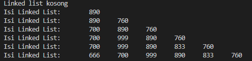
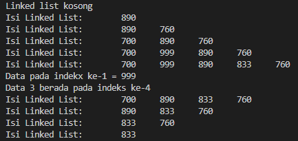
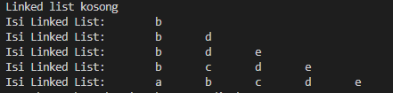
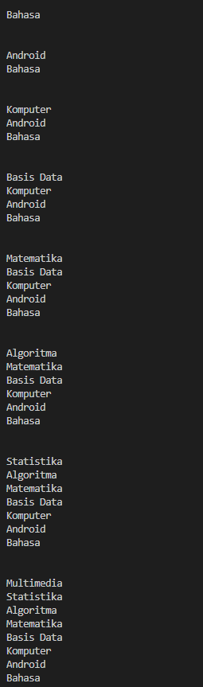
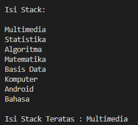
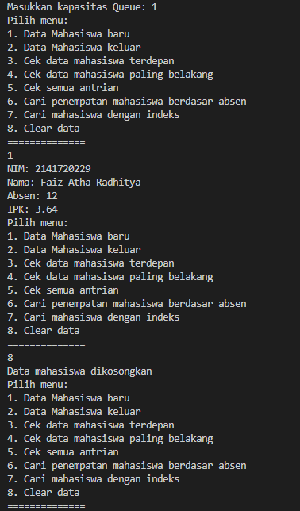

# JOBSHEET IX
>Nama : Faiz Atha Radhitya

> NIM : 2141720229

> Kelas : 1F
# LINKED LIST

### 1. Tujuan Praktikum

```
Setelah melakukan materi praktikum ini, mahasiswa mampu:
```
1. Membuat struktur data linked list
2. Membuat linked list pada program
3. Membedakan permasalahan apa yang dapat diselesaikan menggunakan linked list


### 2. 1 Pembuatan Single Linked List
Node
```java
package jobsheet11.Praktikum.Praktikum1;

public class Node {
    int data;
    Node next;

    public Node(int nilai, Node berikutnya){
        this.data=nilai;
        this.next=berikutnya;
    }
}
```

SingleLinkedList
```java
package jobsheet11.Praktikum.Praktikum1;

public class SingleLinkedList {
    Node head; 
    Node tail;

    public boolean isEmpty(){
        return head == null;
    }

    public void print(){
        if(!isEmpty()){
            Node tmp = head;
            System.out.print("Isi Linked List:\t");
            while(tmp != null){
                System.out.print(tmp.data + "\t");
                tmp = tmp.next;
            }
            System.out.println("");
        }else{
            System.out.println("Linked list kosong");
        }
    }

    public void addFirst(int input){
        Node ndInput = new Node(input, null);
        if(isEmpty()){
            head = ndInput;
            tail = ndInput;
        }else{
            ndInput.next = head;
            head = ndInput;
        }
    }

    public void addLast(int input){
        Node ndInput = new Node(input, null);
        if(isEmpty()){
            head = ndInput;
            tail = ndInput;
        }else{
            tail.next = ndInput;
            tail = ndInput;
        }
    }

    public void insertBefore(int key, int input){
        Node ndInput = new Node(input,null);
        Node temp = head;
        do{
            if((temp.data == key) && (temp == head)){
                addFirst(input);
                break;
            } else {
                ndInput.next = temp.next;
                temp.next = ndInput;
                if(ndInput.next == null) tail = ndInput;
                break;
            }
        } while (temp != null);
    }

    public void insertAfter(int key, int input){
        Node ndInput =  new Node(input, null);
        Node temp = head;
        do{
            if(temp.data == key){
                ndInput.next = temp.next;
                temp.next = ndInput;
                if(ndInput.next==null);
                tail=ndInput;
                break;
            }
            temp = temp.next;
        }while (temp != null);
    }

    public void insertAt(int index, int input){
        if(index<0){
            System.out.println("indeks salah");
        }else if(index == 0){
            addFirst(input);
        }else{
            Node temp = head;
            for(int i=0;i<index-1; i++){
                temp = temp.next;
            }
            temp.next = new Node(input, temp.next);
            if(temp.next.next==null){
                tail=temp.next;
            }
        }
    }
}
```
SLLMain
```java
package jobsheet11.Praktikum.Praktikum1;

public class SLLMain {
    public static void main(String[] args){
        SingleLinkedList singLL = new SingleLinkedList();
        singLL.print();
        singLL.addFirst(890);
        singLL.print();
        singLL.addLast(760);
        singLL.print();
        singLL.addFirst(700);
        singLL.print();
        singLL.insertAfter(700, 999);
        singLL.print();
        singLL.insertAt(3, 833);
        singLL.print();
        singLL.insertBefore(700, 666);
        singLL.print();
    }
}
```
### 2.1.1 Verifikasi Hasil Percobaan



### 2.1.2 Pertanyaan

1. Mengapa hasil compile kode program di baris pertama menghasilkan “Linked List Kosong”?

    Karena eksekusi awal langsung mencetak isi dari linked list yang mana linked listnya berada di dalam kondisi antrian atau listnya sedang kosong atau tidak memiliki data.

2. Pada step 10, jelaskan kegunaan kode berikut
```java
ndInput.next = temp.next;
 temp.next = ndInput;
```

Baris pertama merupakan Node baru yang mana merujuk pada alamat memori dari node setelah key, Baris kedua ialah pointer temp menyimpan alamat memori ndInput


3. Perhatikan class **SingleLinkedList** , pada method **insertAt** Jelaskan kegunaan kode berikut
```java
if(temp.next.next == null) tail = temp.next;
```
Digunakan untuk kondisi jika temp.next.next (temp dari setelah temp) sama dengan null, maka tail sama dengan temp.next
### 2.2 Modifikasi Elemen pada Single Linked List

Waktu percobaan : 30 menit
Didalam praktikum ini, kita akan mempraktekkan bagaimana mengakses elemen, mendapatkan

indeks dan melakukan penghapusan data pada Single Linked List.

### 2.2.1 Langkah-langkah Percobaan

Node
```java
package jobsheet11.Praktikum.Praktikum2;

public class Node {
    int data;
    Node next;

    public Node(int data, Node berikutnya) {
        this.data = data;
        this.next = berikutnya;
    }
}
```
SingleLinkedList
```java
package jobsheet11.Praktikum.Praktikum2;

public class SingleLinkedList {
    Node head;
    Node tail;

    public boolean isEmpty() {
        return head == null;
    }

    public void print() {
        if (!isEmpty()) {
            Node tmp = head;
            System.out.print("Isi Linked List:\t");
            while (tmp != null) {
                System.out.print(tmp.data + "\t");
                tmp = tmp.next;
            }
            System.out.println("");
        } else {
            System.out.println("Linked list kosong");
        }
    }

    public void addFirst(int input) {
        Node ndInput = new Node(input, null);
        if (isEmpty()) {
            head = ndInput;
            tail = ndInput;
        } else {
            ndInput.next = head;
            head = ndInput;
        }
    }

    public void addLast(int input) {
        Node ndInput = new Node(input, null);
        if (isEmpty()) {
            head = ndInput;
            tail = ndInput;
        } else {
            tail.next = ndInput;
            tail = ndInput;
        }
    }

    public void insertAfter(int key, int input) {
        Node ndInput = new Node(input, null);
        Node temp = head;
        do {
            if (temp.data == key) {
                ndInput.next = temp.next;
                temp.next = ndInput;
                if (ndInput.next == null)
                    tail = ndInput;
                break;
            }
            temp = temp.next;
        } while (temp != null);
    }

    public void insertAt(int index, int input) {
        if (index < 0) {
            System.out.println("indeks salah");
        } else if (index == 0) {
            addFirst(input);
        } else {
            Node temp = head;
            for (int i = 0; i < index - 1; i++) {
                temp = temp.next;
            }
            temp.next = new Node(input, temp.next);
            if (temp.next.next == null)
                tail = temp.next;
        }
    }

    public int getData(int index) {
        Node tmp = head;
        for (int i = 0; i < index; i++) {
            tmp = tmp.next;
        }
        return tmp.data;
    }

    public int indexOf(int key) {
        Node tmp = head;
        int index = 0;
        while (tmp != null && tmp.data != key) {
            tmp = tmp.next;
            index++;
        }

        if (tmp == null) {
            return -1;
        } else {
            return index;
        }
    }

    public void removeFirst() {
        if (isEmpty()) {
            System.out.println("Linked List masih Kosong, tidak dapat dihapus!");
        } else if (head == tail) {
            head = tail = null;
        } else {
            head = head.next;
        }
    }

    public void removeLast() {
        if (isEmpty()) {
            System.out.println("Linked List masih Kosong, tidak dapat dihapus");
        } else if (head == tail) {
            head = tail = null;
        } else {
            Node temp = head;
            while (temp.next != tail) {
                temp = temp.next;
            }
            temp.next = null;
            tail = temp;
        }
    }

    public void remove(int key) {
        if (isEmpty()) {
            System.out.println("Linked List masih Kosong, tidak dapat dihapus!");
        } else {
            Node temp = head;
            while (temp != null) {
                if ((temp.data == key) && (temp == head)) {
                    this.removeFirst();
                    break;
                } else if (temp.next.data == key) {
                    temp.next = temp.next.next;
                    if (temp.next == null) {
                        tail = temp;
                    }
                    break;
                }
                temp = temp.next;
            }
        }
    }

    public void removeAt(int index) {
        if (index == 0) {
            removeFirst();
        } else {
            Node temp = head;
            for (int i = 0; i < index - 1; i++) {
                temp = temp.next;
            }
            temp.next = temp.next.next;
            if (temp.next == null) {
                tail = temp;
            }
        }
    }
}
```
SLLMain
```java
package jobsheet11.Praktikum.Praktikum2;

public class SLLMain {
    public static void main(String[] args) {
        SingleLinkedList singLL = new SingleLinkedList();
        singLL.print();
        singLL.addFirst(890);
        singLL.print();
        singLL.addLast(760);
        singLL.print();
        singLL.addFirst(700);
        singLL.print();
        singLL.insertAfter(700, 999);
        singLL.print();
        singLL.insertAt(3, 833);
        singLL.print();

        System.out.println("Data pada indekx ke-1 = " + singLL.gedData(1));
        System.out.println("Data 3 berada pada indeks ke-" + singLL.indexOf(760));

        singLL.remove(999);
        singLL.print();
        singLL.removeAt(0);
        singLL.print();
        singLL.removeFirst();
        singLL.print();
        singLL.removeLast();
        singLL.print();
    }
}
```
### 2.2.2 Hasil Percobaan



### 2.2.3 Pertanyaan

1. Mengapa digunakan keyword break pada fungsi remove? Jelaskan!

    Karena pada code tersebut merupakan sebuah perulangan yang mana pada kondisi tersebut jika salah salah satu dari dua kondisi yang telah ditentukan tersebut terpenuhi, maka sudah tidak perlu dilakukan perulangan lagi, maka dari itu diberikan keyword break agar tidak berulang.


2. Jelaskan kegunaan kode dibawah pada method remove
    ```java
    }else if(temp.next.data == key){
    temp.next = temp.next.next;
    ```
    Jika node punya data yang sama dengan key, maka posisi nya digantikan oleh node selanjutnya
3. Apa saja nilai kembalian yang dapat dikembalikan pada method indexOf? Jelaskan maksud masing-masing kembalian tersebut!

    Jika tmp == null, maka akan mengembalikan nilai -1 atau tidak terdapat dalam index (data kosong).

    jika tidak, maka akan mengembalikan nilai dari index yang diinputkan    

### 3. Tugas

## Waktu pengerjaan : 50 menit

1. Buat method insertBefore untuk menambahkan node sebelum keyword yang diinginkan
    ```java
    public void insertBefore(int key, int input){
        Node ndInput = new Node(input,null);
        Node temp = head;
        do{
            if((temp.data == key) && (temp == head)){
                addFirst(input);
                break;
            } else {
                ndInput.next = temp.next;
                temp.next = ndInput;
                if(ndInput.next == null) tail = ndInput;
                break;
            }
        } while (temp != null);
    }
    ```
2. Implementasikan ilustrasi Linked List Berikut. Gunakan 4 macam penambahan data yang telah dipelajari sebelumnya untuk menginputkan data.

implementasiLinkedList
```java
package jobsheet11.Tugas;

public class implementasiLinkedList {
    char data;
    implementasiLinkedList next;

    public implementasiLinkedList(char data, implementasiLinkedList next) {
        this.data = data;
        this.next = next;
    }
}

class SingleLinkedList_Tugas {
    implementasiLinkedList head;
    implementasiLinkedList tail;

    public boolean isEmpty() {
        return head == null;
    }

    public void print() {
        if (!isEmpty()) {
            implementasiLinkedList tmp = head;
            System.out.print("Isi Linked List:\t");
            while (tmp != null) {
                System.out.print(tmp.data + "\t");
                tmp = tmp.next;
            }
            System.out.println("");
        } else {
            System.out.println("Linked list kosong");
        }
    }

    public void addFirst(char input) {
        implementasiLinkedList ndInput = new implementasiLinkedList(input, null);
        if (isEmpty()) {
            head = ndInput;
            tail = ndInput;
        } else {
            ndInput.next = head;
            head = ndInput;
        }
    }

    public void addLast(char input) {
        implementasiLinkedList ndInput = new implementasiLinkedList(input, null);
        if (isEmpty()) {
            head = ndInput;
            tail = ndInput;
        } else {
            tail.next = ndInput;
            tail = ndInput;
        }
    }

    public void insertAfter(char key, char input) {
        implementasiLinkedList ndInput = new implementasiLinkedList(input, null);
        implementasiLinkedList temp = head;
        do {
            if (temp.data == key) {
                ndInput.next = temp.next;
                temp.next = ndInput;
                if (ndInput.next == null)
                    tail = ndInput;
                break;
            }
            temp = temp.next;
        } while (temp != null);
    }

    public void insertBefore(char key, char input) {
        implementasiLinkedList ndInput = new implementasiLinkedList(input, null);
        implementasiLinkedList temp = head;
        do {
            if ((temp.data == key) && (temp == head)) {
                this.addFirst(input);
                break;
            } else if (temp.next.data == key) {
                ndInput.next = temp.next;
                temp.next = ndInput;
                break;
            }
            temp = temp.next;
        } while (temp != null);
    }

    public void insertAt(int index, char input) {
        if (index < 0) {
            System.out.println("indeks salah");
        } else if (index == 0) {
            addFirst(input);
        } else {
            implementasiLinkedList temp = head;
            for (int i = 0; i < index - 1; i++) {
                temp = temp.next;
            }
            temp.next = new implementasiLinkedList(input, temp.next);
            if (temp.next.next == null)
                tail = temp.next;
        }
    }
}

class Tugas2_SLLMain {
    public static void main(String[] args) {
        SingleLinkedList_Tugas ilusSLL = new SingleLinkedList_Tugas();
        ilusSLL.print();
        ilusSLL.addFirst('b');
        ilusSLL.print();
        ilusSLL.addLast('d');
        ilusSLL.print();
        ilusSLL.insertAfter('d', 'e');
        ilusSLL.print();
        ilusSLL.insertBefore('d', 'c');
        ilusSLL.print();
        ilusSLL.insertAt(0, 'a');
        ilusSLL.print();
    }
}
```
**Hasil**



3. Buatlah Implementasi Stack berikut menggunakan Single Linked List
```java
package jobsheet11.Tugas;

public class implementasiStack {
    String data;
    implementasiStack next;

    public implementasiStack(String data, implementasiStack next) {
        this.data = data;
        this.next = next;
    }
}

class implementasiStackSSL {
    implementasiStack head;
    implementasiStack tail;

    public boolean isEmpty() {
        return head == null;
    }

    public void print() {
        if (!isEmpty()) {
            implementasiStack tmp = head;
            System.out.println("");
            while (tmp != null) {
                System.out.println(tmp.data);
                tmp = tmp.next;
            }
            System.out.println();
        } else {
            System.out.println("Stack Masih Kosong!");
        }
    }

    public void peek() {
        if (!isEmpty()) {
            implementasiStack tmp = head;
            System.out.println("Isi Stack Teratas : " + tmp.data);
        } else {
            System.out.println("Stack Masing Kosong!");
        }
    }

    public void pushAwal(String input) {
        implementasiStack ndInput = new implementasiStack(input, null);
        if (isEmpty()) {
            head = ndInput;
            tail = ndInput;
        } else {
            ndInput.next = head;
            head = ndInput;
        }
    }
}

class Tugas3_implementasiStack_Main {
    public static void main(String[] args) {
        implementasiStackSSL sllStack = new implementasiStackSSL();
        sllStack.pushAwal("Bahasa");
        sllStack.print();
        sllStack.pushAwal("Android");
        sllStack.print();
        sllStack.pushAwal("Komputer");
        sllStack.print();
        sllStack.pushAwal("Basis Data");
        sllStack.print();
        sllStack.pushAwal("Matematika");
        sllStack.print();
        sllStack.pushAwal("Algoritma");
        sllStack.print();
        sllStack.pushAwal("Statistika");
        sllStack.print();
        sllStack.pushAwal("Multimedia");
        sllStack.print();

        System.out.println("Isi Stack: ");
        sllStack.print();
        sllStack.peek();
    }
}
```

**Hasil**




4. Buatlah implementasi program antrian untuk mengilustasikan mahasiswa yang sedang meminta tanda tangan KRS pada dosen DPA di kampus pada tugas jobsheet 8 menggunakan LinkedList.Implementasikan Queue pada antrian mahasiswa dengan menggunakan konsep LinkedList!

MahasiswaL
```java
package jobsheet11.Tugas;

public class MahasiswaL {
    String nim;
    String nama;
    int absen;
    double ipk;
    MahasiswaL next;
    
    public MahasiswaL(String nim, String nama, int absen, double ipk, MahasiswaL lanjut){
        this.nim = nim;
        this.nama = nama;
        this.absen = absen;
        this.ipk = ipk;
        this.next = lanjut;
    }    
}

```

MahasiswaMain
```java
package jobsheet11.Tugas;

import java.util.Scanner;

public class MahasiswaMain {
    public static void menu(){
        System.out.println("Pilih menu: ");
        System.out.println("1. Data Mahasiswa baru");
        System.out.println("2. Data Mahasiswa keluar");
        System.out.println("3. Cek data mahasiswa terdepan");
        System.out.println("4. Cek data mahasiswa paling belakang");
        System.out.println("5. Cek semua antrian");
        System.out.println("6. Cari penempatan mahasiswa berdasar absen");
        System.out.println("7. Cari mahasiswa dengan indeks");
        System.out.println("8. Clear data");
        System.out.println("==============");
    }

    public static void main(String[] args) {
        Scanner sc = new Scanner(System.in);
        Scanner s = new Scanner(System.in);
        
        System.out.print("Masukkan kapasitas Queue: ");
        int jumlah = sc.nextInt();
        
        MahasiswaSLL antri = new MahasiswaSLL();
        
        int pilih;
        
        do{
            menu();
            pilih = sc.nextInt();
            sc.nextLine();
            switch(pilih){
                case 1:
                    System.out.print("NIM: ");
                    String nim = sc.nextLine();
                    System.out.print("Nama: ");
                    String nama = sc.nextLine();
                    System.out.print("Absen: ");
                    int absen = s.nextInt();
                    System.out.print("IPK: ");
                    double ipk = s.nextDouble();
                    antri.enqueue(nim, nama, absen, ipk);
                    break;
                
                case 2:
                    antri.dequeue();
                    break;
                
                case 3:
                    antri.peek();
                    break;
                
                case 4:
                    antri.peekRear();
                    break;
                    
                case 5:
                    antri.print();
                    break;
                    
                case 6:
                    System.out.print("Masukkan absen mahasiswa: ");
                    int absene = s.nextInt();
                    antri.peekData(absene);
                    break;
                    
                case 7:
                    System.out.print("Masukkan indeks yang dicari: ");
                    int indeks = s.nextInt();
                    antri.peekIndex(indeks);
                    break;
                 
                case 8: 
                    antri.clear(jumlah);
                    break;
            }
        }while (pilih == 1 || pilih == 2 || pilih == 3 || pilih == 4 || pilih == 5 || pilih == 6 || pilih == 7 || pilih == 8);
        
        sc.close();
        s.close();
    }
}

```

MahasiswaSLL
```java
package jobsheet11.Tugas;

public class MahasiswaSLL {
    MahasiswaL head;
        MahasiswaL tail;
        
            
        public boolean isEmpty(){
            return head == null;
        }
    
        public void print(){
            if(!isEmpty()){
                MahasiswaL temp = head;
                int i = 0;
                System.out.print("Isi Mahasiswa:\t");
                while (temp != null){
                    System.out.println("Data Mahasiswa ke-" + i + "= " + temp.nim + " " + temp.nama + " " + temp.absen
                    + " " + temp.ipk);
                    temp = temp.next;
                    i++;
                }
                System.out.println("");
            } else {
                System.out.println("Queue kosong");
            }
        }
    
        public void peek(){
            if(!isEmpty()){
                MahasiswaL temp = head;
                System.out.println("Data mahasiswa terdepan= " + temp.nim + " " + temp.nama + " " + temp.absen
                    + " " + temp.ipk);
            } else {
                System.out.println("Queue kosong");
            }
        }
        
        public void peekRear(){
            if(!isEmpty()){
                MahasiswaL temp = head;
                while(temp != null){
                    if(temp == tail){
                        System.out.println("Antrian paling belakang = " + temp.nim + " " + temp.nama + " " + temp.absen
                    + " " + temp.ipk);
                    }else {
                        System.out.println("Queue kosong");
                    }
                    temp = temp.next;
                }
            }
        }
        
        public void peekIndex(int index){
            MahasiswaL temp = head;
            for (int i = 0; i < index - 1; i++){
                    temp = temp.next;
                }
            System.out.println("Data mahasiswa pada indeks ke-" + index + "= " + temp.nim + " " + temp.nama + " " + temp.absen
                    + " " + temp.ipk);
        }
        
        public int peekData(int key){
            MahasiswaL temp = head;
            int index = 0;
            while (temp != null && temp.absen != key){
                temp = temp.next;
                index++;
            }
            if(temp == null){
                System.out.println("Queue kosong");
                return -1;
            } else {
                System.out.println("Data mahasiswa " + key + "berada pada index ke-" + index);
                System.out.println("Data mahasiswa " + temp.nim + " " + temp.nama + " " + temp.absen
                    + " " + temp.ipk);
                return index;
            }
        }
    
        
        public void enqueue(String nim, String nama, int absen, double ipk){
            MahasiswaL temp = new MahasiswaL(nim, nama, absen, ipk, null);
            if(isEmpty()){ 
                head = temp; 
                tail = temp;
            } else {
                tail.next = temp;
                tail = temp;
            }
        }
        
        public void dequeue(){
            if(isEmpty()){
                System.out.println("Queue, tidak dapat dihapus");
            } else if (head == tail){
                head = tail = null;
            } else {
                head = head.next;
            }
        }
        
        public void clear(int data){
            if(!isEmpty()){
                head = tail = null;
                data = 0;
                System.out.println("Data mahasiswa dikosongkan");
            } else {
                System.out.println("Queue Kosong");
            }
        }
}

```

**Hasil**



