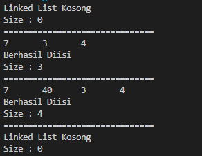
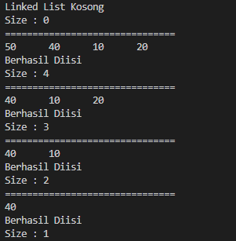
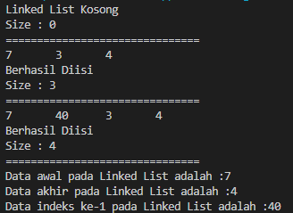
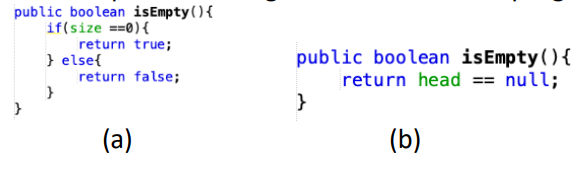
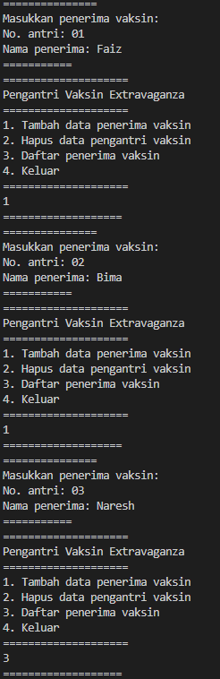
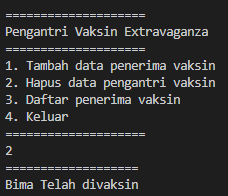
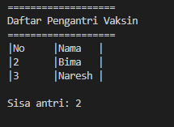
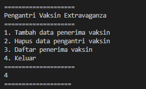

# JOBSHEET 12

# Double Linked Lists

## 12.1 Tujuan Praktikum

```
Setelah melakukan praktikum ini, mahasiswa mampu:
```
1. memahami algoritma double linked lists;
2. membuat dan mendeklarasikan struktur algoritma double linked lists;
3. menerapkan algoritma double linked lists dalam beberapa _study case_.

## 12 .2 Kegiatan Praktikum 1

## 12 .2.1 Percobaan 1

Pada percobaan 1 ini akan dibuat class Node dan class DoubleLinkedLists yang didalamnya
terdapat operasi-operasi untuk menambahkan data dengan beberapa cara (dari bagian depan linked
list, belakang ataupun indeks tertentu pada linked list).

1. Perhatikan diagram class Node dan class DoublelinkedLists di bawah ini! Diagram class ini yang
    selanjutnya akan dibuat sebagai acuan dalam membuat kode program DoubleLinkedLists.
       Node
data: int
prev: Node
next: Node
Node(prev: Node, data:int, next:Node)


```
DoubleLinkedLists
head: Node
size : int
DoubleLinkedLists()
isEmpty(): boolean
addFirst (): void
addLast(): void
add(item: int, index:int): void
size(): int
clear(): void
print(): void
```
2. Buat paket baru dengan nama **doublelinkedlists**
3. Buat class di dalam paket tersebut dengan nama **Node**
4. Di dalam class tersebut, deklarasikan atribut sesuai dengan diagram class di atas.
5. Selanjutnya tambahkan konstruktor default pada class Node sesuai diagram di atas.
6. Buatlah sebuah class baru bernama DoubleLinkedLists pada package yang sama dengan node
    seperti gambar berikut:


7. Pada class DoubleLinkedLists tersebut, deklarasikan atribut sesuai dengan diagram class di atas.
8. Selajuntnya, buat konstruktor pada class DoubleLinkedLists sesuai gambar berikut.
9. Buat method **isEmpty()**. Method ini digunakan untuk memastikan kondisi linked list kosong.
10. Kemudian, buat method **addFirst().** Method ini akan menjalankan penambahan data di bagian
    depan linked list.
11. Selain itu pembuatan method **addLast()** akan menambahkan data pada bagian belakang linked
    list.
12. Untuk menambakan data pada posisi yang telah ditentukan dengan indeks, dapat dibuat dengan
    method **add(int item, int index)**


13. Jumlah data yang ada di dalam linked lists akan diperbarui secara otomatis, sehingga dapat dibuat
    method **size()** untuk mendapatkan nilai dari size.
14. Selanjutnya dibuat method **clear()** untuk menghapus semua isi linked lists, sehingga linked lists
    dalam kondisi kosong.
15. Untuk mencetak isi dari linked lists dibuat method **print().** Method ini akan mencetak isi linked
    lists berapapun size-nya. Jika kosong akan dimunculkan suatu pemberitahuan bahwa linked lists
    dalam kondisi kosong.


16. Selanjutya dibuat class Main DoubleLinkedListsMain untuk mengeksekusi semua method yang
    ada pada class DoubleLinkedLists.
17. Pada main class pada langkah 16 di atas buatlah object dari class DoubleLinkedLists kemudian
    eksekusi potongan program berikut ini.


**12. 2 .2 Verifikasi Hasil Percobaan**



**12. 2 .3 Pertanyaan Percobaan**

1. Jelaskan perbedaan antara single linked list dengan double linked lists!

    Single Linked List : Tidak bisa kembali ke node sebelumnya (tidak ada prev), sedangkan
    Double Linked List : Bisa kembali ke node sebelumnya (ada prev)

2. Perhatikan class Node, didalamnya terdapat atribut next dan prev. Untuk apakah atribut tersebut?

    Digunakan untuk ke node selanjutnya (next) dan sebelumnya (prev)

3. Perhatikan konstruktor pada class DoubleLinkedLists. Apa kegunaan inisialisasi atribut head dan size seperti pada gambar berikut ini?

    ```java
    public DoubleLinkedList(){
        head = null;
        size = 0
    }
    ```

    Mengartikan bahwa, Artinya Linked List kosong atau tidak ada data di dalamnya

4. Pada method **addFirst()** , kenapa dalam pembuatan object dari konstruktor class Node prev dianggap sama dengan null?  
    ```java
    Node newNode = new Node( **null** , item, head);
    ```
    Karena memang tidak ada data sebelumnya atau di depanya first

5. Perhatikan pada method **addFirst().** Apakah arti statement head.prev = newNode?

    data sebelum head adalah Node baru yang akan menjadi head baru

6. Perhatikan isi method **addLast()** , apa arti dari pembuatan object Node dengan mengisikan parameter prev dengan current, dan next dengan null? Node newNode = new Node( **current** , item, **null** );

    ```java
    Node newNode = new Node(current, item, null);
    ```


## 12. 3 Kegiatan Praktikum 2

**12. 3 .1 Tahapan Percobaan**
Pada praktikum 2 ini akan dibuat beberapa method untuk menghapus isi LinkedLists pada
class DoubleLinkedLists. Penghapusan dilakukan dalam tiga cara di bagian paling depan, paling
belakang, dan sesuai indeks yang ditentukan pada linkedLists. Method tambahan tersebut akan
ditambahkan sesuai pada diagram class berikut ini.

```
DoubleLinkedLists
head: Node
size : int
DoubleLinkedLists()
isEmpty(): boolean
addFirst (): void
addLast(): void
add(item: int, index:int): void
size(): int
clear(): void
print(): void
**removeFirst(): void
removeLast(): void
remove(index:int):void**
```

1. Buatlah method **removeFirst()** di dalam class **DoubleLinkedLists.**
2. Tambahkan method **removeLast()** di dalam class **DoubleLinkedLists.**


3. Tambahkan pula method **remove(int index)** pada class **DoubleLinkedLists** dan amati hasilnya.
4. Untuk mengeksekusi method yang baru saja dibuat, tambahkan potongan kode program
    berikut pada **main class.**


**12. 3 .2 Verifikasi Hasil Percobaan**



**12. 3. 3 Pertanyaan Percobaan**

1. Apakah maksud statement berikut pada method **removeFirst()**?
    ```
    head = head.next;
    head.prev = null;
    ```

    Head baru adalah node setelah head lama, head baru menjadikan head.prev nya null di karenakan kosong

2. Bagaimana cara mendeteksi posisi data ada pada bagian akhir pada method **removeLast()**?

    Dilihat apakah head.next = null dengan while Node current = head hingga current.next.next = null berhenti dan head = null

3. Jelaskan alasan potongan kode program di bawah ini tidak cocok untuk perintah **remove**!
    ```java
    Node tmp = head.next;

    head.next = tmp.next;
    tmp.next.prev = head;
    ```
    karena menggunakan head dan akan menjadikan yang diremove head baru

4. Jelaskan fungsi kode program berikut ini pada fungsi **remove**!
    ```java
    current.prev.next = current.next;
    current.next.prev = current prev;
    ```
    menggabungkan bagian kosong di current yang dihapus
## 12. 4 Kegiatan Praktikum 3

**12. 4 .1 Tahapan Percobaan**
Pada praktikum 3 ini dilakukan uji coba untuk mengambil data pada linked list dalam 3
kondisi, yaitu mengambil data paling awal, paling akhir dan data pada indeks tertentu dalam
linked list. Method mengambil data dinamakan dengan **get**. Ada 3 method get yang dibuat pada
praktikum ini sesuai dengan diagram class DoubleLinkedLists.

```
DoubleLinkedLists
head: Node
size : int
DoubleLinkedLists()
isEmpty(): boolean
addFirst (): void
addLast(): void
add(item: int, index:int): void
size(): int
clear(): void
print(): void
removeFirst(): void
removeLast(): void
remove(index:int):void
getFirst(): int
getLast() : int
get(index:int): int
```
1. Buatlah method **getFirst()** di dalam class DoubleLinkedLists untuk mendapatkan data pada
    awal linked lists.


2. Selanjutnya, buatlah method **getLast()** untuk mendapat data pada akhir linked lists.
3. Method **get(int index)** di buat untuk mendapatkan data pada indeks tertentu
4. Pada main class tambahkan potongan program berikut dan amati hasilnya!


**12. 4 .2 Verifikasi Hasil Percobaan**



**12. 4 .3 Pertanyaan Percobaan**

1. Jelaskan method **size()** pada class DoubleLinkedLists!

    mereturn size untuk mengetahui seberapa besar size yang ada pada class

2. Jelaskan cara mengatur indeks pada double linked lists supaya dapat dimulai dari indeks ke- 1!

    Dengan memberi nilai 0 pada indeks ke-0 dengan addFirst()


3. Jelaskan perbedaan karakteristik fungsi **Add** pada Double Linked Lists dan Single Linked Lists!

    untuk Menambah Node baru pada class

4. Jelaskan perbedaan logika dari kedua kode program di bawah ini!



    A = Berarti Node-nya dimulai dari 0 sehingga ada nilainya
    B = Berarti Node head tidak ada di satupun linked list jadi tidak ada sama valuenya sama sekali

## 12. 5 Tugas Praktikum

1. Buat program antrian vaksinasi menggunakan queue berbasis double linked list sesuai ilustrasidan menu di bawah ini! 
Vaksin
```java
package jobsheet12.Tugas;

public class vaksin {
    node head;
    int size;

    public vaksin() {
        head = null;
        size = 0;
    }

    public boolean isEmpty() {
        return head == null;
    }

    public void print() {
        if (!isEmpty()) {
            node tmp = head;
            System.out.println("===================");
            System.out.println("Daftar Pengantri Vaksin");
            System.out.println("===================");
            System.out.println("|No\t|Nama\t|");
            while (tmp != null) {
                System.out.print("|" + tmp.no + "\t|" + tmp.nama + "\t|");
                System.out.println();
                tmp = tmp.next;
            }
            System.out.println();
            System.out.println("Sisa antri: " + size);
            System.out.println();
        } else {
            System.out.println("Linked list kosong");
        }
    }

    public void addFirst(int no, String nama) {
        if (isEmpty()) {
            head = new node(null, no, nama, null);
        } else {
            node newNode = new node(null, no, nama, head);
            head.prev = newNode;
            head = newNode;
        }
        size++;
    }

    public void addLast(int no, String nama) {
        if (isEmpty()) {
            addFirst(no, nama);
        } else {
            node current = head;
            while (current.next != null) {
                current = current.next;
            }
            node newNode = new node(current, no, nama, null);
            current.next = newNode;
            size++;
        }
    }

    public void removeFirst() throws Exception {
        if (isEmpty()) {
            throw new Exception("Linked list masih kosong, tidak dapat dihapus");
        } else if (size == 1) {
            removeLast();
            System.out.println(head.nama + " Telah divaksin");
        } else {
            head = head.next;
            head.prev = null;
            size--;
            System.out.println(head.nama + " Telah divaksin");
        }
    }

    public void removeLast() throws Exception {
        if (isEmpty()) {
            throw new Exception("Linked list masih kosong, tidak dapat dihapus");
        } else if (head.next == null) {
            head = null;
            size--;
            return;
        }
        node current = head;
        while (current.next.next != null) {
            current = current.next;
        }
        current.next = null;
        size--;
    }
}

```
VaksinMain
```java
package jobsheet12.Tugas;

import java.util.Scanner;

public class vaksinMain {
    public static void menu() {
        System.out.println("====================");
        System.out.println("Pengantri Vaksin Extravaganza");
        System.out.println("====================");
        System.out.println("1. Tambah data penerima vaksin");
        System.out.println("2. Hapus data pengantri vaksin");
        System.out.println("3. Daftar penerima vaksin");
        System.out.println("4. Keluar");
        System.out.println("====================");
    }

    public static void main(String[] args) throws Exception {
        Scanner sc = new Scanner(System.in);
        Scanner s = new Scanner(System.in);
        int pilih;

        vaksin v = new vaksin();

        do {
            menu();
            pilih = sc.nextInt();
            sc.nextLine();
            System.out.println("===================");
            try {
                switch (pilih) {
                    case 1:
                        System.out.println("===============");
                        System.out.println("Masukkan penerima vaksin: ");
                        System.out.print("No. antri: ");
                        int no = sc.nextInt();
                        System.out.print("Nama penerima: ");
                        String nama = s.nextLine();
                        v.addLast(no, nama);
                        System.out.println("===========");
                        break;
                    case 2:
                        v.removeFirst();
                        v.print();
                        break;
                    case 3:
                        v.print();
                        break;
                    case 4:
                        System.exit(0);
                        break;
                }
            } catch (Exception E) {

            }
        } while (pilih <= 4 || pilih >= 1);

        sc.close();
        s.close();
    }
}

```
NodeVaksin
```java
package jobsheet12.Tugas;

public class nodeVaksin {
    String nama;
    int no;
    nodeVaksin prev, next;

    nodeVaksin(nodeVaksin prev, int no, String nama, nodeVaksin next) {
        this.prev = prev;
        this.nama = nama;
        this.no = no;
        this.next = next;
    }
}

```









2. Buatlah program daftar film yang terdiri dari id, judul dan rating menggunakan double linked lists, bentuk program memiliki fitur pencarian melalui ID Film dan pengurutan Rating secara descending. Class Film wajib diimplementasikan dalam soal ini.
Film
```java
package jobsheet12.Tugas;

public class Film {
    nodeFilm head;
    int size;

    public Film() {
        head = null;
        size = 0;
    }

    public boolean isEmpty() {
        return head == null;
    }

    public void addFirst(String id, String judul, double rating) {
        if (isEmpty()) {
            head = new nodeFilm(null, id, judul, rating, null);
        } else {
            nodeFilm newNode = new nodeFilm(null, id, judul, rating, null);
            head.prev = newNode;
            head = newNode;
        }
        size++;
    }

    public void addLast(String id, String judul, double rating) {
        if (isEmpty()) {
            addFirst(id, judul, rating);
        } else {
            nodeFilm current = head;
            while (current.next != null) {
                current = current.next;
            }
            nodeFilm newNode = new nodeFilm(current, id, judul, rating, null);
            current.next = newNode;
            size++;
        }
    }

    public void add(String id, String judul, double rating, int index) throws Exception {
        if (isEmpty()) {
            addFirst(id, judul, rating);
        } else if (index < 0 || index > size) {
            throw new Exception("Nilai index film diluar batas");
        } else {
            nodeFilm current = head;
            int i = 0;
            while (i < index) {
                current = current.next;
                i++;
            }
            if (current.prev == null) {
                nodeFilm newNode = new nodeFilm(null, id, judul, rating, current);
                current.prev = newNode;
                head = newNode;
            } else {
                nodeFilm newNode = new nodeFilm(current.prev, id, judul, rating, current);
                newNode.prev = current.prev;
                newNode.next = current;
                current.prev.next = newNode;
                current.prev = newNode;
            }
        }
        size++;
    }

    public int size() {
        return size;
    }

    public void clear() {
        head = null;
        size = 0;
    }

    public void print() {
        if (!isEmpty()) {
            nodeFilm tmp = head;
            while (tmp != null) {
                System.out.println("ID: " + tmp.id);
                System.out.println(" Judul Film: " + tmp.judul);
                System.out.println(" Rating Film: " + tmp.rating);
                System.out.println();
                tmp = tmp.next;
            }
            System.out.println("Sisa Film: " + size);
        } else {
            System.out.println("Linked list film kosong");
        }
    }

    public void removeFirst() throws Exception {
        if (isEmpty()) {
            throw new Exception("Linked list film masih kosong, tidak dapat dihapus");
        } else if (size == 1) {
            removeLast();
        } else {
            head = head.next;
            head.prev = null;
            size--;
        }
    }

    public void removeLast() throws Exception {
        if (isEmpty()) {
            throw new Exception("Linked list film masih kosong, tidak dapat dihapus");
        } else if (head.next == null) {
            head = null;
            size--;
            return;
        }
        nodeFilm current = head;
        while (current.next.next != null) {
            current = current.next;
        }
        current.next = null;
        size--;
    }

    public void remove(int index) throws Exception {
        if (isEmpty() || index >= size) {
            throw new Exception("Nilai indeks film diluar batas");
        } else if (index == 0) {
            removeFirst();
        } else {
            nodeFilm current = head;
            int i = 0;
            while (i < index) {
                current = current.next;
                i++;
            }
            if (current.next == null) {
                current.prev.next = null;
            } else if (current.prev == null) {
                current = current.next;
                current.prev = null;
                head = current;
            } else {
                current.prev.next = current.next;
                current.next.prev = current.prev;
            }
        }
        size--;
    }

    public void bubbleSort() {
        nodeFilm current = null, index = null;
        double tmp;
        String temp;
        if (isEmpty()) {
            return;
        } else {
            for (current = head; current.next != null; current = current.next) {
                for (index = current.next; index != null; index = index.next) {
                    if (current.rating < index.rating) {
                        tmp = current.rating;
                        current.rating = index.rating;
                        index.rating = tmp;
                        temp = current.id;
                        current.id = index.id;
                        index.id = temp;
                        temp = current.judul;
                        current.judul = index.judul;
                        index.judul = temp;
                    }
                }
            }
        }
    }

    public void searching(String cari) {
        int i = 0;
        boolean flag = false;
        nodeFilm current = head;

        if (head == null) {
            System.out.println("List film kosong");
            return;
        }
        while (current != null) {
            if (current.id.equalsIgnoreCase(cari)) {
                flag = true;
                break;
            }
            current = current.next;
            i++;
        }
        if (flag) {
            System.out.println("ID: " + cari + " ditemukan di indeks ke-" + i);
        } else {
            System.out.println("Film tidak ada di list");
        }
    }
}

```
FilmMain
```java
package jobsheet12.Tugas;

import java.util.Scanner;

public class FilmMain {
    public static void menu() {
        System.out.println("====================");
        System.out.println("Data Film Layar Lebar");
        System.out.println("====================");
        System.out.println("1. Tambah data awal");
        System.out.println("2. Tambah data akhir");
        System.out.println("3. Tambah data indeks tertentu");
        System.out.println("4. Hapus data pertama");
        System.out.println("5. Hapus data terakhir");
        System.out.println("6. Hapus data tertentu");
        System.out.println("7. Cetak");
        System.out.println("8. Cari ID Film");
        System.out.println("9. Urut data rating Film");
        System.out.println("10. Keluar");
        System.out.println("====================");
    }

    public static void main(String[] args) throws Exception {
        Scanner sc = new Scanner(System.in);
        Scanner s = new Scanner(System.in);
        int pilihMenu, indeks;
        String cari;

        Film m = new Film();

        do {
            menu();
            pilihMenu = sc.nextInt();
            sc.nextLine();
            System.out.println("===================");
            try {
                switch (pilihMenu) {
                    case 1:
                        System.out.println("===============");
                        System.out.println("Masukkan ID Film: ");
                        String id = s.nextLine();
                        System.out.print("Masukkan Judul Film: ");
                        String judul = s.nextLine();
                        System.out.print("Masukkan Rating Film: ");
                        double rating = sc.nextDouble();
                        m.addFirst(id, judul, rating);
                        System.out.println("===========");
                        break;
                    case 2:
                        System.out.println("===============");
                        System.out.println("Masukkan ID Film: ");
                        id = s.nextLine();
                        System.out.print("Masukkan Judul Film: ");
                        judul = s.nextLine();
                        System.out.print("Masukkan Rating Film: ");
                        rating = sc.nextDouble();
                        m.addLast(id, judul, rating);
                        System.out.println("===========");
                        break;
                    case 3:
                        System.out.println("===============");
                        System.out.println("Masukkan indeks dimana Film dimasukkan: ");
                        indeks = sc.nextInt();
                        System.out.println("Masukkan ID Film: ");
                        id = s.nextLine();
                        System.out.print("Masukkan Judul Film: ");
                        judul = s.nextLine();
                        System.out.print("Masukkan Rating Film: ");
                        rating = sc.nextDouble();
                        m.add(id, judul, rating, indeks);
                        System.out.println("===========");
                        break;
                    case 4:
                        m.removeFirst();
                        System.out.println("Data Film Pertama telah dihapus");
                        break;
                    case 5:
                        m.removeLast();
                        System.out.println("Data Film Terakhir telah dihapus");
                        break;
                    case 6:
                        System.out.print("Masukkan indeks data Film yang ingin dihapus: ");
                        indeks = sc.nextInt();
                        m.remove(indeks);
                        break;
                    case 7:
                        m.print();
                        break;
                    case 8:
                        System.out.print("Masukkan ID Film yang ingin dicari: ");
                        cari = s.nextLine();
                        m.searching(cari);
                        break;
                    case 9:
                        m.bubbleSort();
                        m.print();
                        break;
                    case 10:
                        System.exit(0);
                        break;

                }
            } catch (Exception E) {

            }

        } while (pilihMenu <= 10 || pilihMenu >= 1);

        sc.close();
        s.close();
    }
}

```
nodeFilm
```java
package jobsheet12.Tugas;

public class nodeFilm {
    String judul, id;
    double rating;
    nodeFilm prev, next;

    nodeFilm(nodeFilm prev, String id, String judul, double rating, nodeFilm next) {
        this.prev = prev;
        this.next = next;
        this.id = id;
        this.judul = judul;
        this.rating = rating;
    }
}

```


