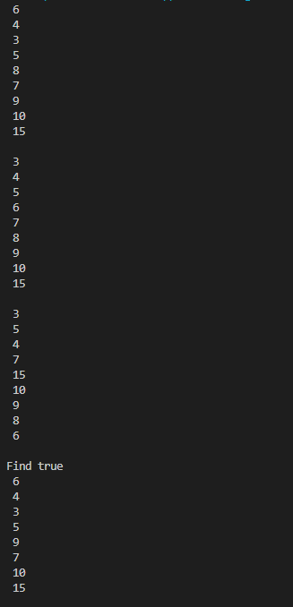
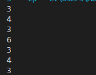
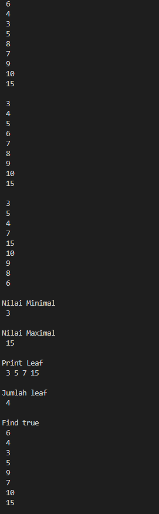
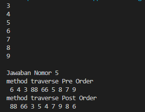

```
NAMA : Faiz Atha Radhitya
KELAS : 1F
NIM : 2141720229
```
# JOBSHEET XIII

# TREE

**1. Tujuan Praktikum**
    Setelah melakukan praktikum ini, mahasiswa mampu:
    1. memahami model _Tree_ khususnya _Binary Tree_
    2. membuat dan mendeklarasikan struktur algoritma _Binary Tree_.
    3. menerapkan dan mengimplementasikan algoritma _Binary Tree_ dalam kasus
       _Binary Search Tree_
**2. Praktikum
2.1 Implementasi Binary Search Tree menggunakan Linked List
2.1.1 Tahapan percobaan**
    **Waktu Percobaan ( 45 menit)**
Pada percobaan ini akan diimplementasikan Binary Search Tree dengan operasi dasar,
dengan menggunakan array (praktikum 2) dan linked list (praktikum 1). Sebelumnya,
akan dibuat class Node, dan Class BinaryTree

```
Node
```
```
data: int
left: Node
```
```
right: Node
Node(left: Node, data:int, right:Node)
```
```
BinaryTree
root: Node
size : int
DoubleLinkedLists()
```
```
add(data: int): void
find(data: int) : boolean
traversePreOrder (node : Node) : void
traversePostOrder (node : Node) void
traverseInOrder (node : Node): void
getSuccessor (del: Node)
add(item: int, index:int): void
delete(data: int): void
```

1. Buatlah class **Node** , **BinaryTree** dan **BinaryTreeMain**
2. Di dalam class **Node** , tambahkan atribut **data** , **left** dan **right** , serta konstruktor
    default dan berparameter.
3. Di dalam class **BinaryTree** , tambahkan atribut **root**.
4. Tambahkan konstruktor default dan method **isEmpty()** di dalam class **BinaryTree**
5. Tambahkan method **add()** di dalam class **BinaryTree**. Di bawah ini proses
    penambahan node **tidak dilakukan secara rekursif** , agar lebih mudah dilihat alur
    proses penambahan node dalam tree. Sebenarnya, jika dilakukan dengan proses
    rekursif, penulisan kode akan lebih efisien.
6. Tambahkan method find()
7. Tambahkan method **traversePreOrder()** , **traverseInOrder()** dan
    **traversePostOrder()**. Method traverse digunakan untuk mengunjungi dan
    menampilkan node-node dalam tree, baik dalam mode pre-order, in-order
    maupun post-order.
8. Tambahkan method **getSuccessor()**. Method ini akan digunakan ketika proses
    penghapusan node yang memiliki 2 child.
9. Tambahkan method **delete()**.
Di dalam method delete tambahkan pengecekan apakah tree kosong, dan jika tidak
cari posisi node yang akan di hapus.
Kemudian tambahkan proses penghapusan terhadap node current yang telah
ditemukan.
10. Buka class BinaryTreeMain dan tambahkan method main().
11. Compile dan jalankan class BinaryTreeMain untuk mendapatkan simulasi jalannya
    program tree yang telah dibuat.
12. Amati hasil running tersebut.

BinaryTree
```java
package jobsheet14.Praktikum;

public class BinaryTree {
        Node root;
    
        public BinaryTree(){
            root = null;
        }
        boolean isEmpty(){
            return root==null;
        }
    
        void add(int data){
            if(isEmpty()){
                root = new Node(data);
            }else{
                Node current = root;
                while(true){
                    if(data<current.data){
                        if(current.left!=null){
                            current = current.left;
                        }else{
                            current.left = new Node(data);
                            break;
                        }
                    }else if(data>current.data){
                        if(current.right!=null){
                            current = current.right;
                        }else{
                            current.right = new Node(data);
                            break;
                        }
                    }else{
                        break;
                    }
                }
            }
        }
    
        boolean find(int data){
            boolean hasil = false;
            Node current = root;
            while(current!=null){
                if(current.data==data){
                    hasil = true;
                    break;
                }else if(data<current.data){
                    current = current.left;
                }else{
                    current = current.right;
                }
            }
            return hasil;
        }
    
        void traversePreOrder(Node node){
            if(node != null){
                System.out.println(" " + node.data);
                traversePreOrder(node.left);
                traversePreOrder(node.right);
            }
        }
    
        void traversePostOrder(Node node){
            if(node != null){
                traversePostOrder(node.left);
                traversePostOrder(node.right);
                System.out.println(" " + node.data);
            }
        }
    
        void traverseInOrder(Node node){
            if(node != null){
                traverseInOrder(node.left);
                System.out.println(" " + node.data);
                traverseInOrder(node.right);
            }
        }
    
        Node getSuccessor(Node del){
            Node successor = del.right;
            Node successorParent = del;
            while(successor.left!=null){
                successorParent = successor;
                successor = successor.left;
            }
            if(successor != del.right){
                successorParent.left = successor.right;
                successor.right = del.right;
            }
            return successor;
        }
    
        void delete(int data){
            if(isEmpty()){
                System.out.println("Tree is empty!");
                return;
            }
    
            Node parent = root;
            Node current = root;
            boolean isLeftChild = false;
            while(current != null){
                if(current!=null){
                    if(current.data==data){
                        break;
                    }else if(data<current.data){
                        parent = current;
                        current = current.left;
                        isLeftChild = true;
                    }else if(data>current.data){
                        parent = current;
                        current = current.right;
                        isLeftChild = false;
                    }
                }
            }
    
            if(current==null){
                System.out.println("Couldn't find data!");
                return;
            }else{
                if(current.left==null&&current.right==null){
                    if(current==root){
                        root = null;
                    }else{
                        if(isLeftChild){
                            parent.left = null;
                        }else{
                            parent.right = null;
                        }
                    }
                }else if(current.left==null){
                if(current==root){
                    root = current.right;
                }else{
                    if(isLeftChild){
                        parent.left = current.right;
                    }else{
                        parent.right = current.right;
                    }
                }
                }else if(current.right==null){
                    if(current==root){
                        root=current.left;
                    }else{
                        if(isLeftChild){
                            parent.left = current.left;
                        }else{
                            parent.right = current.left;
                        }
                    }
                }else{
                    Node successor = getSuccessor(current);
                    if(current==root){
                        root = successor;
                    }else{
                        if(isLeftChild){
                            parent.left = successor;
                        }else{
                            parent.right = successor;
                        }
                        successor.left = current.left;
                    }
                }
            }
        }
}

````

BinaryTreeMain
```java
package jobsheet14.Praktikum;

public class BinaryTreeMain {
    public static void main(String[] args){
        BinaryTree bt = new BinaryTree();

        bt.add(6);
        bt.add(4);
        bt.add(8);
        bt.add(3);
        bt.add(5);
        bt.add(7);
        bt.add(9);
        bt.add(10);
        bt.add(15);

        bt.traversePreOrder(bt.root);
        System.out.println("");
        bt.traverseInOrder(bt.root);
        System.out.println("");
        bt.traversePostOrder(bt.root);
        System.out.println("");
        System.out.println("Find " +bt.find(5));
        bt.delete(8);
        bt.traversePreOrder(bt.root);
        System.out.println("");
    }
}

```

Node
```java
package jobsheet14.Praktikum;

public class Node {
    int data;
    Node left;
    Node right;


    public Node(){    
    }
    public Node(int data){
        this.left = null;
        this.data = data;
        this.right = null;
    }
}
```

HASIL RUN



**2.1.2 Pertanyaan Percobaan**

1. Mengapa dalam binary search tree proses pencarian data bisa lebih efektif
    dilakukan dibanding binary tree biasa?

    Karena pada Binary Search Tree node disusun sudah secara berurutan (Pohon Biner Terurut) yang mana penempatan data berdasarkan Left Child akan selalu lebih kecil dari node induk, dan right child akan lebih besar dari node induk.

2. Untuk apakah di class **Node** , kegunaan dari atribut **left** dan **right**?

    Pada class node atribut left berfungsi untuk menyimpan "left child" atau nilai yang lebih kecil dari root (node induk) dan atribut right berfungsi untuk menyimpan "right child" atau nilai yang lebih besar dari root (node induk)

3. a. Untuk apakah kegunaan dari atribut **root** di dalam class **BinaryTree**?

     untuk menyimpan data yang berada pada bagian paling atas tree

    b. Ketika objek tree pertama kali dibuat, apakah nilai dari **root**?

    ketika objek tree pertama kali dibuat nilai dari root bernilai null, karena masih belum ada data yang dimasukan

4. Ketika tree masih kosong, dan akan ditambahkan sebuah node baru, proses apa
    yang akan terjadi?
    ```java
    method add(int data), if(isEmpty()) maka root = new node(data)
    ```

5. Perhatikan method **add()** , di dalamnya terdapat baris program seperti di bawah
    ini. Jelaskan secara detil untuk apa baris program tersebut?
```JAVA
if(data<current.data){
if(current.left!=null){
current = current.left;
}else{
current.left = new Node(data);
break;
}
```


 Jika data yang ada di node selanjut tidak kosong maka data sekarang menjadi current left, dan jika tidak ada maka akan mencetak node baru

**2.2 Implementasi binary tree dengan array
Waktu percobaan: 45 menit**

**2.2.1 Tahapan Percobaan**

1. Di dalam percobaan implementasi binary tree dengan array ini, data tree
    disimpan dalam array dan langsung dimasukan dari method main(), dan
    selanjutnya akan disimulasikan proses traversal secara inOrder.
2. Buatlah class **BinaryTreeArray** dan **BinaryTreeArrayMain**
3. Buat atribut **data** dan **idxLast** di dalam class **BinaryTreeArray**. Buat juga method
    **populateData()** dan **traverseInOrder().**
4. Kemudian dalam class **BinaryTreeArrayMain** buat method main() seperti gambar
    berikut ini.
5. Jalankan class **BinaryTreeArrayMain** dan amati hasilnya!

BinaryTreeArray
```java
package jobsheet14.Praktikum;

public class BinaryTreeArray {
    int[] data;
    int idxlast;

    public BinaryTreeArray(){
        data = new int[10];
    }

    void populateData(int data[], int idxlast){
        this.data = data;
        this.idxlast = idxlast;
    }

    void traverseinOrder(int idxStart){
        if(idxStart <= idxlast){
            traverseinOrder(2*idxStart+1);
            System.out.println(data[idxStart]+" ");
            traverseinOrder(2*idxStart+1);
        }
    }
}

```

BinaryTreeArrayMain
```java
package jobsheet14.Praktikum;

public class BinaryTreeArrayMain {
    public static void main(String[] args) {
        BinaryTreeArray bta = new BinaryTreeArray();
        int[] data = {6,4,8,3,5,7,9,0,0,0};
        int idxLast = 6;
        bta.populateData(data, idxLast);
        bta.traverseinOrder(0);
    
    } 
}

```
HASIL RUN



**13.2.1 Pertanyaan Percobaan**

1. Apakah kegunaan dari atribut data dan idxLast yang ada di class
    **BinaryTreeArray**?

    Atribut data berfungsi untuk menyimpan data array, sedangkan idxLast berfungsi untuk menyimpan batas index

2. Apakah kegunaan dari method **populateData()**?

    Untuk menunjukkan data pada idxLast

3. Apakah kegunaan dari method **traverseInOrder()**?

    Untuk menelusuri tree dengan metode in order dengan prinsip(left visit right)

4. Jika suatu node binary tree disimpan dalam array indeks 2, maka di indeks
    berapakah posisi left child dan rigth child masin-masing?

    Left child pada indeks ke 5, dan right child pada indeks ke 6

5. Apa kegunaan statement int idxLast = 6 pada praktikum 2 percobaan nomor
    4?

    Untuk menunjukkan idxLast atau batas indeks arraynya adalah 6

**13.3 Tugas Praktikum
Waktu pengerjaan: 9 0 menit**

1. Buat method di dalam class **BinaryTree** yang akan menambahkan node
    dengan cara rekursif.
    ```java
    //// Jawaban Nomor 1
    void addNodeR(int key){ 
        root = addNodeR(root, key);
    }
    public Node addNodeR(Node current, int data){
        if (current == null){
            return new Node(data);
        }
        if (data < current.data){
            current.left = addNodeR(current.left, data);
        }else if(data > current.data){
            current.right = addNodeR(current.right, data);
        }else{
            return current;
        }
        return current;
    }
    ```
2. Buat method di dalam class **BinaryTree** untuk menampilkan nilai paling kecil
    dan yang paling besar yang ada di dalam tree.
    ```java
    //// Jawaban Nomor 2
    void maksimal(){    
        Node current = root;
        while(current.right != null){
            current = current.right;
        }
        System.out.println(current.data);
    }
    void minimal(){
        Node current = root;
        while(current.left != null){
            current = current.left;
        }
        System.out.println(current.data);
    }
    ```

3. Buat method di dalam class **BinaryTree** untuk menampilkan data yang ada
    di leaf.
    ```java
    //// Jawaban Nomor 3
     void printLeaf(Node root){  
        if(root == null){
        return;            
        }
        if(root.left == null && root.right == null){
            System.out.print(" "+ root.data);
            return;
        }if(root.left != null){
            printLeaf(root.left);
        }if(root.right != null){
            printLeaf(root.right);
        }
    }
    ```

4. Buat method di dalam class **BinaryTree** untuk menampilkan berapa jumlah
    leaf yang ada di dalam tree.
    ```java
    //// Jawaban Nomor 4
    int jumlahLeaf(){  
        return jumlahLeaf(root);
    }
    int jumlahLeaf(Node node){
        if(node == null){
            return 0;
        }
        if(node.left == null && node.right == null){
            return 1;
        }else{
            return jumlahLeaf(node.left)+jumlahLeaf(node.right);
        }
    }
    ````



5. Modifikasi class **BinaryTreeArray** , dan tambahkan :
    - method **add(int data)** untuk memasukan data ke dalam tree
    - method **traversePreOrder()** dan **traversePostOrder()**

    BinaryTreeArray

    ```java
    package jobsheet14.Tugas;

    public class BinaryTreeArrayMain {
    public static void main(String[] args) {
        BinaryTreeArray bta = new BinaryTreeArray();
        int[] data = {6,4,8,3,5,7,9,0,0,0};
        int idxLast = 6;
        bta.populateData(data, idxLast);
        bta.traverseinOrder(0);
        
        System.out.println("");
        System.out.println("Jawaban Nomor 5");
        bta.add(88);
        bta.add(66);
        System.out.println("method traverse Pre Order");
        bta.traversePreOrder(0);
        System.out.println("");
        System.out.println("method traverse Post Order");
        bta.traversePostOrder(0);
        System.out.println("");
        } 
    }

    ```

    BinaryArrayTreeMain
    ```java
            package jobsheet14.Tugas;

    public class BinaryTreeArray {
        int[] data;
        int idxlast;
        
        public BinaryTreeArray(){
            data = new int[10];
        }
        
        void populateData(int data[], int idxlast){
            this.data = data;
            this.idxlast = idxlast;
        }
        
        void traverseinOrder(int idxStart){
            if(idxStart <= idxlast){
                traverseinOrder(2*idxStart+1);
                System.out.println(data[idxStart]+" ");
                traverseinOrder(2*idxStart+2);
            }
        }
        
            void add(int data){
            if(idxlast == this.data.length -1){
                System.out.println("Tree Array sudah Penuh");
            }else{
                this.data[++idxlast] = data;
            }
        }
        void traversePreOrder(int idxStart){
            if(idxStart <= idxlast){
                System.out.print(" "+data[idxStart]);
                traversePreOrder(2 * idxStart + 1);
                traversePreOrder(2 * idxStart + 2);
            }
        }
        void traversePostOrder(int idxStart){
            if(idxStart <= idxlast){
                traversePostOrder(2 * idxStart + 1);
                traversePostOrder(2 * idxStart + 2);
                System.out.print(" "+data[idxStart]);
            }
        }
    }

    ```
    

