# **Jobsheet 6**
 ## Faiz Atha Radhitya

 ### 1F / 2141720229

# SORTING (BUBBLE, SELECTION, DAN INSERTION SORT)
## 5.1 Tujuan Praktikum 
Setelah melakukan praktikum ini diharapkan mahasiswa mampu:

1. Mahasiswa mampu membuat algoritma searching bubble sort, selection sort dan insertion sort

2. Mahasiswa mampu menerapkan algoritma searching bubble sort, selection sort dan insertion sort pada program
## 5.2.1 Langkah - langkah Percobaan
Mahasiswa
```java 
public class Mahasiswa {
    String nama;
    int thnMasuk;
    int umur;
    double ipk;
    
    Mahasiswa(String n,int t, int u, double i){
        nama = n;
        umur = u;
        thnMasuk = t;
        ipk = i;
    }
    
    void tampil(){
        System.out.println("Nama: " + nama);
        System.out.println("Umur: " + umur);
        System.out.println("Tahun Masuk: " + thnMasuk);
        System.out.println("IPK: " + ipk);
    }
}
```

DaftarMahasiswaBerprestasi
```java
public class DaftarMahasiswaBerprestasi {
    Mahasiswa[] listMhs = new Mahasiswa[5];
    int idx;
    
    void tambah(Mahasiswa mhs){
        if(idx<listMhs.length) {
            listMhs[idx] = mhs;
            idx++;
        } else {
            System.out.println("Data sudah penuh!");
        }
    }
    
    void tampil(){
        for(Mahasiswa m: listMhs){
            m.tampil();
            System.out.println("==========================");
        }
    }
    void bubbleSort(){
        for(int i = 0; i < listMhs.length - 1; i++){
            for(int j=1; j < listMhs.length - i; j++){
                if(listMhs[j].ipk > listMhs[j-1].ipk){
                    Mahasiswa tmp = listMhs[j];
                    listMhs[j] = listMhs[j-1]; //listMhs[j-1[ KOSONG
                    listMhs[j-1] = tmp;
                }
            }
        }
    }
    void selectionSort(){
        for(int i = 0; i < listMhs.length - 1; i++){
            int idxMin = i;
            for(int j = i + i+1; j < listMhs.length; j++){
                if(listMhs[j].ipk < listMhs[idxMin].ipk){
                    idxMin = j;
                }
            }
            Mahasiswa tmp = listMhs[idxMin];
            listMhs[idxMin] = listMhs[i];
            listMhs[i] = tmp;
        }
    }
    void insertionSort(){
        for(int i = 1; i < listMhs.length; i++){
            Mahasiswa temp = listMhs[i];
            int j = i;
            while (j > 0 && listMhs[j-1].ipk > temp.ipk){
                listMhs[j] = listMhs[j-1];
                j--;
            }
            listMhs[j] = temp;
        }
    }
}
```

mainMahasiswa
```java
public class mainMahasiswa {
    public static void main(String[] args) {
        DaftarMahasiswaBerprestasi list = new DaftarMahasiswaBerprestasi();
        Mahasiswa m1 = new Mahasiswa("Nusa", 2017, 25, 3);
        Mahasiswa m2 = new Mahasiswa("Rara", 2012, 19, 4);
        Mahasiswa m3 = new Mahasiswa("Dompu", 2018, 19, 5);
        Mahasiswa m4 = new Mahasiswa("Abdul", 2017, 23, 2);
        Mahasiswa m5 = new Mahasiswa("Ummi", 2019, 21, 3.75);
        
        list.tambah(m1);
        list.tambah(m2);
        list.tambah(m3);
        list.tambah(m4);
        list.tambah(m5);
        
        System.out.println("Data Mahasiswa Sebelum Sorting = ");
        list.tampil();
        
        System.out.println("Data Mahasiswa Setelah Sorting Desc Berdasarkan IPK"); //desc = besar ke kecil
        list.bubbleSort();
        list.tampil();
    } 
}
```
## 5.2.2 Verifikasi Hasil Percobaan
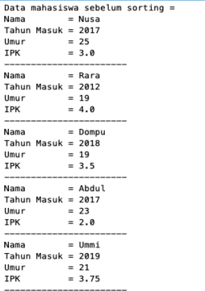
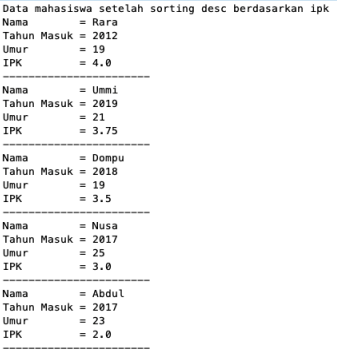

## 5.2.3 Pertanyaan
1. Terdapat di method apakah proses bubble sort?

    Terdapat di method void bubbleSort()

2. Terdapat di method apakah proses selection sort?

    Terdapat di method void selectionSort()

3. Apakah yang dimaksud proses swap? Tuliskan potongan program untuk melakukanproses swap tersebut!
```java
Mahasiswa tmp = listMhs[j];
    listMhs[j] = listMhs[j-1]; 
    listMhs[j-1] = tmp;
```
4. Di dalam method bubbleSort(), terdapat baris program seperti dibawah ini:

<image src ="img/soalno4.png">

program diatas digunakan untuk proses swap atau penukaran(BubbleSort), dibuat agar tidak serta merta menukar

5. Perhatikan perulangan di dalam bubbleSort() di bawah ini:

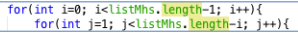

a. Apakah perbedaan antara kegunaan perulangan i dan perulangan j?

Outer i, Berfungsi agar pengurutan terus berjalan hingga semua terurut

 Inner j, Berfungsi melakukan pertukaran nilai secara terus menerus hingga urut

b. Mengapa syarat dari perulangan i adalah i < listMhs.length-1 ?

Karena yang diminta untuk di outputkan di data itu berjumlah 4, jadi karena length atau panjang dari mahasiswanya 5 maka perlu dikurangi 1 agar outputnya bisa 4.

c. Mengapa syarat dari perulangan j adalah j\<listMhs.length-i ?

agar batas dari perulangan j (perulangan dalam) memiliki rentang panjang sejumlah panjang array listMhs dikurangi i ketika melakukan swapping / penukaran nilai dari array listMhs agar bisa urut.

d. Jika banyak data di dalam listMhs adalah 50, maka berapakali perulangan i akan berlangsung? Dan ada berapa tahap bubble sort yang ditempuh?

 perulangan i akan berlangsung sebanyak 49 kali dan begitu juga dengan tahap bubble sortnya.

</br>


## 5.3 Mengurutkan Data Mahasiswa Berdasarkan IPK Menggunakan Selection Sort
Jika pada praktikum yang sebelumnya kita telah mengurutkan data mahasiwa
berdasarkan IPK menggunakan Bubble Sort secara descending, pada kali ini kita akan
mencoba untuk menambahkan fungsi pengurutan menggunakan Selection Sort.

## 5.3.1. Langkah-langkah Percobaan
DaftarMahasiswaBerprestasi
```java
    void selectionSort(){
        for(int i = 0; i < listMhs.length - 1; i++){
            int idxMin = i;
            for(int j = i + i+1; j < listMhs.length; j++){
                if(listMhs[j].ipk < listMhs[idxMin].ipk){
                    idxMin = j;
                }
            }
            Mahasiswa tmp = listMhs[idxMin];
            listMhs[idxMin] = listMhs[i];
            listMhs[i] = tmp;
        }
    }
```

mainMahasiswa
```java
System.out.println("Data Mahasiswa Setelah Sorting Asc Berdasarkan IPK"); 
list.selectionSort();
list.tampil();
```
## 5.3.2. Verifikasi Hasil Percobaan
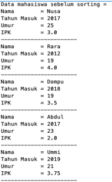

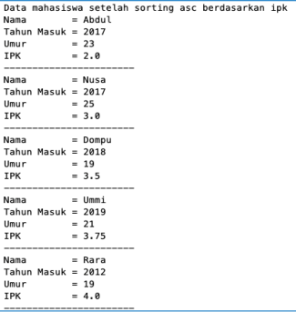

## 5.3.3. Pertanyaan

Di dalam method selection sort, terdapat baris program seperti dibawah ini:

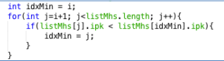

Untuk apakah proses tersebut, jelaskan!
- int idxMin = i digunakan untuk data pada index ke i 
- for(int j=i+1; j<listMhs.length; j++)  digunakan untuk startnya disebelahnya i atau data setelahnya i hingga akhir;
- if(listMhs[j].ipk < listMhs[idxMin].ipk) digunakan untuk membandingkan apakah nilai idxMin lebih besar dari listMhs[j];
- idxMin = j; digunakan untuk j menjadi nilai baru dari idxMin.


 </br>


## 5.4 Mengurutkan Data Mahasiswa Berdasarkan IPK Menggunakan Insertion Sort
Yang terakhir akan diimplementasikan Teknik sorting menggunakan Insertion Sort,
dengan mengurutkan IPK mahasiswa secara ascending.

## 5.4.1 Langkah-langkah Percobaan
 DaftarMahasiswaBerprestasi
```java
    void insertionSort(){
        for(int i = 1; i < listMhs.length; i++){
            Mahasiswa temp = listMhs[i];
            int j = i;
            while (j > 0 && listMhs[j-1].ipk > temp.ipk){
                listMhs[j] = listMhs[j-1];
                j--;
            }
            listMhs[j] = temp;
        }
    }
```

 mainMahasiswa
```java
System.out.println("Data Mahasiswa Setelah Sorting Asc Berdasarkan IPK"); 
list.insertionSort();
list.tampil();
```
## 5.4.2 Verifikasi Hasil Percobaan
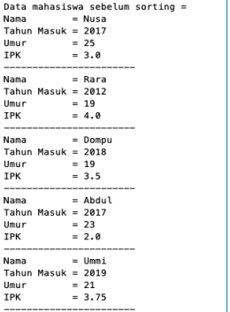

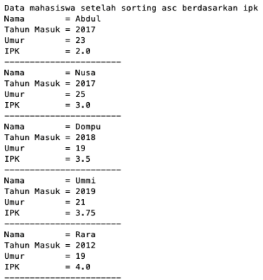

## 5.4.3 Pertanyaan

1. Ubahlah fungsi pada InsertionSort sehingga fungsi ini dapat melaksanakan proses sorting dengan cara ascending atau decending, anda dapat melakukannya dengan menambahkan parameter pada pemanggilan fungsi insertionSort.

DaftarMahasiswaBerprestasi
```java
    void insertionSort(boolean asc){
        for(int i = 1; i < listMhs.length; i++){
            Mahasiswa temp = listMhs[i];
            int j = i;
            
            if(asc){
            while (j > 0 && listMhs[j-1].ipk > temp.ipk){
                listMhs[j] = listMhs[j-1];
                j--;
            }
            }else {
                
            while (j > 0 && listMhs[j-1].ipk < temp.ipk){
                listMhs[j] = listMhs[j-1];
                j--;
            }      
            listMhs[j] = temp;
        }
    }
}
```
mainMahasiswa
```java
System.out.println("Data Mahasiswa Setelah Insertion Sorting Asc Berdasarkan IPK"); 
list.insertionSort(true);
list.tampil();
```
```java
System.out.println("Data Mahasiswa Setelah Insertion Sorting Desc Berdasarkan IPK"); 
list.insertionSort(false);
list.tampil();
```
## 5.5 Latihan Praktikum

Sebuah yang bergerak dalam bidang penjualan tiket pesawat sedang mengembangkan backend untuk sistem pemesanan tiket, salah satu fiturnya adalah menampilkan daftar tiket yang tersedia berdasarkan pilihan filter yang diinginkan user. Daftar tiket ini harus dapat di sorting berdasarkan harga dimulai dari harga termurah ke harga tertinggi. Implementasikanlah class diagram berikut ini kedalam bahasapemrograman java kemudian buatlah proses sorting data untuk harga tiket menggunakan algoritma **bubble sort** dan **selection sort**.

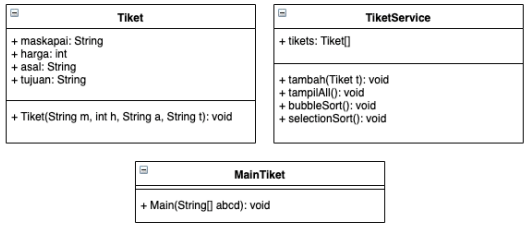
 
 latihanMainTiket
 ```java
 package jobsheet6.Praktikum;

public class latihanMainTiket {
     public static void main(String[] args) {
        latihanSistemTiket bandara = new latihanSistemTiket();
        latihanTiket t1 = new latihanTiket("Garuda Indonesia", 2500000, "Pontianak", "Jakarta");
        latihanTiket t2 = new latihanTiket("Batik Air", 850000, "Surabaya", "Palangkaraya");
        latihanTiket t3 = new latihanTiket("Air Asia", 1200000, "Jogja", "Medan");
        latihanTiket t4 = new latihanTiket("Citilink", 1550000, "Balikpapan", "Jakarta");
        latihanTiket t5 = new latihanTiket("Sriwijaya Air",900000, "Surakarta", "Bali");
        
        bandara.tambah(t1);
        bandara.tambah(t2);
        bandara.tambah(t3);
        bandara.tambah(t4);
        bandara.tambah(t5);
        
        System.out.println("==============================");
        System.out.println("=====Data Sebelum Sorting=====");
        System.out.println("==============================");
        bandara.tampil();
        System.out.println("");
        System.out.println("==================================");
        System.out.println("Data ticket setelah di sorting berdasarkan :");
        System.out.println("Sorting dengan metode Bubble sort :");
        bandara.bubbleSort();
        bandara.tampil();
        System.out.println();
        System.out.println("======================================");
        System.out.println("Sorting dengan metode Selection sort :");
        System.out.println("======================================");
        System.out.println("");
        bandara.selectionSort();
        bandara.tampil();
        System.out.println("==================================");
      }
}
```
latihanTiket
```java
package jobsheet6.Praktikum;

public class latihanTiket {
    String maskapai;
    String asal;
    String tujuan;
    int harga;
    
    latihanTiket(String m, int h, String a, String t){
        maskapai = m;
        harga = h;
        asal = a;
        tujuan = t;
    }
    
    void tampil(){
        System.out.println("============================");
        System.out.println("======JUANDA AIRPORT=======");
        System.out.println("============================");
        System.out.println("Nama Maskapai: " + maskapai);
        System.out.println("Harga: Rp." + harga+",-");
        System.out.println("Asal: " + asal);
        System.out.println("Tujuan: " + tujuan);
    }
}
```

latihanSistemTiket
```java
package jobsheet6.Praktikum;

public class latihanSistemTiket {
    latihanTiket tkt[] = new latihanTiket[5];
    int tik;
    
    void tambah(latihanTiket t) {
        if (tik < tkt.length) {
            tkt[tik] = t;
            tik++;
        } else {
            System.out.println("Maaf Data Penuh");
        }
    }
    
    void tampil(){
        for (latihanTiket t : tkt){
            t.tampil();
        }
    }
    
    void bubbleSort(){
        for (int i = 0; i < tkt.length - 1; i++){
            for (int j = 1; j < tkt.length - i; j++){
                if (tkt[j].harga > tkt[j-1].harga){
                    latihanTiket swp = tkt[j]; //swap
                    tkt[j] = tkt[j-1];
                    tkt[j-1] = swp;
                }
            }
        }
    }
    
    void selectionSort(){
        for(int i=0;i<tkt.length-1;i++){
            int idxMin = i;
            for(int j=i+1;j<tkt.length;j++){
                if(tkt[j].harga<tkt[idxMin].harga){
                    idxMin = j;
                }
            }latihanTiket tmp = tkt[idxMin];
            tkt[idxMin] = tkt[i];
            tkt[i] = tmp;
        }
    }
}
```
Hasil

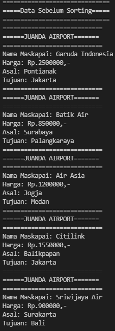

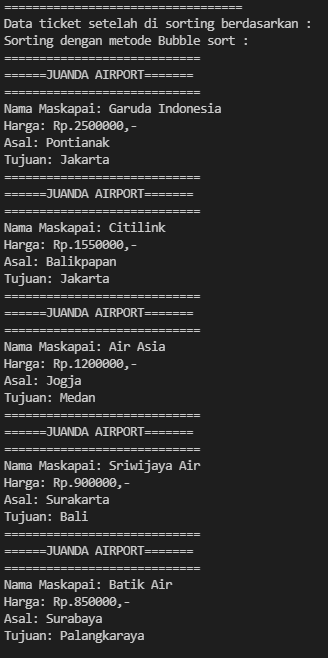

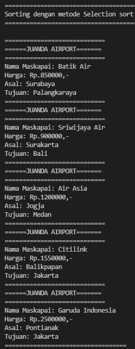
